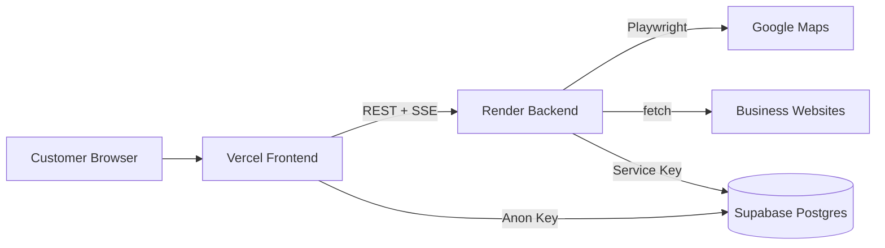

# LeadPilot

LeadPilot is the **paying customer product** — a business discovery and prospecting platform. It runs as a monorepo with a Next.js frontend (Vercel), Express + Playwright backend (Render), and Supabase database.

> **Note:** The sales landing page is a standalone HTML file on WordPress/Elementor. It is **not** part of this repository.

## Architecture



| Layer | Tech | Deploy |
|-------|------|--------|
| Frontend | Next.js 15, React 19 | Vercel |
| Backend | Express, Playwright | Render (Docker) |
| Database | Supabase Postgres | Supabase |
| Shared | TypeScript types/utils | npm workspace |

## Folder structure

```
/leadpilot (repo root)
├── frontend/          Next.js app
│   ├── app/           Routes (/ , /dashboard, /demo-recording)
│   ├── components/    UI + dashboard shell
│   ├── features/      results table, CSV export
│   ├── hooks/         useSearch lifecycle
│   ├── services/      API client
│   ├── styles/        globals.css
│   └── utils/         helpers, demo data
├── backend/           Express API + scraper
│   └── src/
│       ├── api/       search + health routers
│       ├── scraper/   Playwright maps + fetch email crawler
│       ├── services/  scraper orchestration
│       ├── queues/    in-memory job queue
│       └── database/  Supabase client + repository
├── shared/            @leadpilot/shared types + utils
├── canvas-ad/         Motion ad tool (separate)
├── motion-video/      Remotion promos (separate)
└── docker-compose.yml
```

## Local development

**Important:** run all commands from the project folder, not your home directory.

```bash
cd ~/LeadRush   # or wherever you cloned the repo
npm install
npm run setup
```

### Prerequisites

- Node.js 20+
- Playwright Chromium (`npm run setup`)
- Supabase project with migration applied

### Without Docker

```bash
npm install
npm run setup

# Shared + backend
cp backend/.env.example backend/.env
# Fill SUPABASE_URL and SUPABASE_SERVICE_KEY

cp frontend/.env.local.example frontend/.env.local
# Set NEXT_PUBLIC_API_URL=http://localhost:3001

npm run build --workspace=@leadpilot/shared
npm run dev:backend    # port 3001
npm run dev            # port 3000
```

### With Docker

```bash
export SUPABASE_URL=...
export SUPABASE_SERVICE_KEY=...
docker-compose up --build
```

## Environment variables

**Deployment uploads:** download ready-to-fill files from [`deploy/`](./deploy/README.md):

- [`deploy/vercel.env.example`](./deploy/vercel.env.example) → Vercel → Settings → Environment Variables → **Import .env**
- [`deploy/render.env.example`](./deploy/render.env.example) → Render → Environment → **Add from .env**

### Frontend (`frontend/.env.local`)

| Variable | Example |
|----------|---------|
| `NEXT_PUBLIC_API_URL` | `http://localhost:3001` |
| `NEXT_PUBLIC_SUPABASE_URL` | Your Supabase URL |
| `NEXT_PUBLIC_SUPABASE_ANON_KEY` | Your anon key |

### Backend (`backend/.env`)

| Variable | Default | Description |
|----------|---------|-------------|
| `PORT` | `3001` | HTTP port |
| `NODE_ENV` | `development` | Environment |
| `SUPABASE_URL` | — | Required |
| `SUPABASE_SERVICE_KEY` | — | Required |
| `SCRAPER_CONCURRENCY` | `3` | Parallel scrape jobs |
| `FRONTEND_URL` | `http://localhost:3000` | CORS origin |

## API reference

Base URL: `http://localhost:3001` (local) or your Render URL.

### `POST /search`

Start a new search job.

**Request**
```json
{ "query": "restaurants", "location": "Lagos" }
```

**Response** `201`
```json
{ "searchId": "uuid", "status": "pending" }
```

### `GET /search/:id`

Get job status.

**Response**
```json
{
  "id": "uuid",
  "query": "restaurants",
  "location": "Lagos",
  "status": "running",
  "totalFound": 12,
  "processed": 12,
  "createdAt": "...",
  "updatedAt": "...",
  "error": null
}
```

### `GET /search/:id/results?page=1&limit=50`

Paginated business leads.

### `GET /search/:id/stream`

Server-Sent Events stream. Event types: `lead`, `progress`, `phase`, `complete`, `error`.

### `GET /health`

**Response**
```json
{
  "status": "ok",
  "playwright": "ready",
  "network": "ok",
  "timestamp": "...",
  "version": "0.1.0"
}
```

## Deployment

### Vercel (frontend)

See **[deploy/VERCEL.md](./deploy/VERCEL.md)** if you get `404 DEPLOYMENT_NOT_FOUND`.

1. Import repo at [vercel.com](https://vercel.com)
2. Set **Root Directory** to `frontend`
3. Add environment variables:
   - `NEXT_PUBLIC_API_URL` → your Render backend URL (e.g. `https://leadpilot-backend.onrender.com`)
   - `NEXT_PUBLIC_SUPABASE_URL`
   - `NEXT_PUBLIC_SUPABASE_ANON_KEY`
3. Deploy

### Render (backend)

1. New **Web Service** → connect this repo
2. Use **Blueprint** (`render.yaml` at repo root) or set:
   - Runtime: Docker
   - Dockerfile path: `backend/Dockerfile`
   - Docker context: `.` (repo root)
   - Health check path: `/health`
3. Add environment variables: `SUPABASE_URL`, `SUPABASE_SERVICE_KEY`, `FRONTEND_URL` (your Vercel URL)

### Supabase

Run migration: `backend/src/database/migrations/001_initial.sql`

## Scripts

| Command | Description |
|---------|-------------|
| `npm run dev` | Frontend dev server |
| `npm run dev:backend` | Backend dev server |
| `npm run build` | Build all workspaces |
| `npm run lint` | Lint frontend + backend |
| `npm run setup` | Install Playwright Chromium |
| `npm run check-playwright` | Verify Playwright |

## Design tokens

| Token | Value |
|-------|-------|
| Background | `#07070A` |
| Surface | `#0F0F14` |
| Surface 2 | `#16161E` |
| Accent | `#7C3AED` |
| Accent light | `#A855F7` |
| Green | `#10B981` |
| White | `#F4F4FF` |
| Muted | `#6B6B80` |
