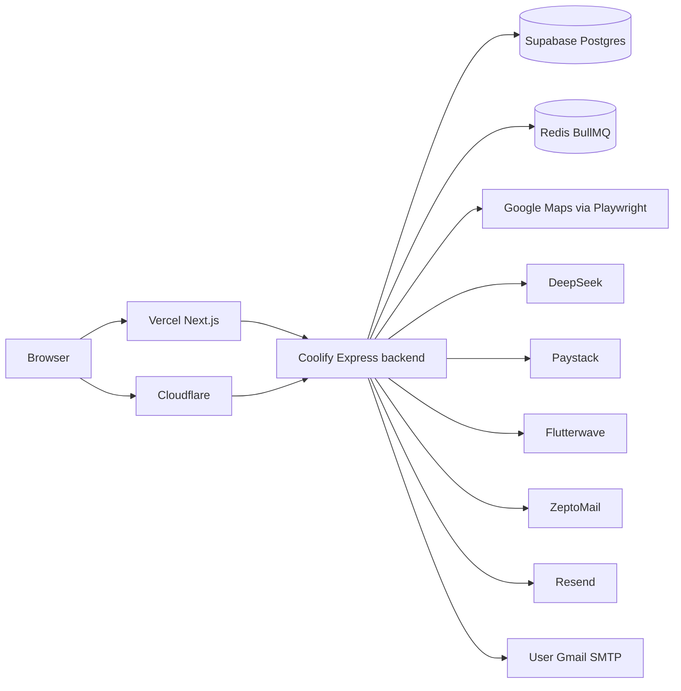
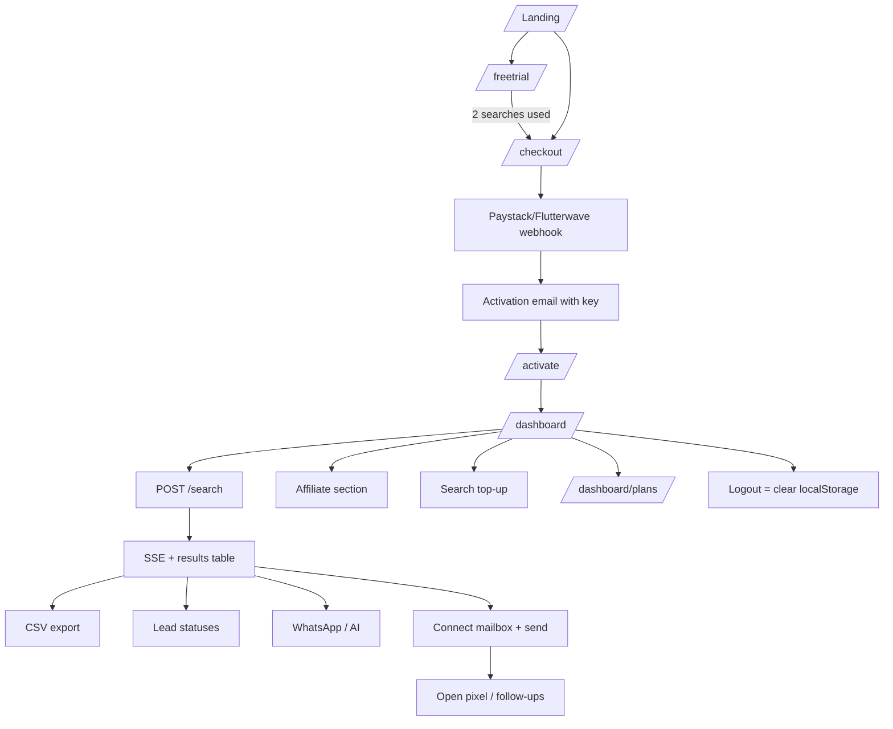
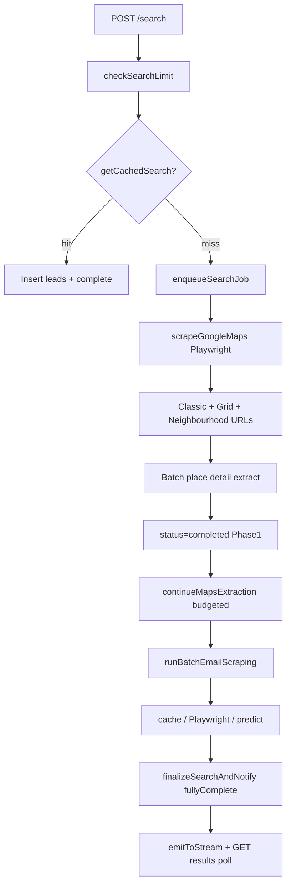
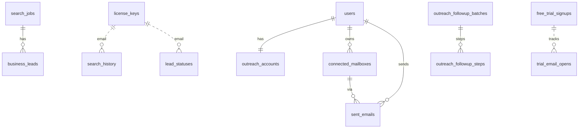

# LeadThur Complete Internal Documentation

**Mode:** Read-only reverse engineering  
**Repo:** `/Users/donbamz/LeadRush`  
**Brand in code:** LeadThur (folder still LeadRush)  
**Rule:** Every claim is from the codebase. Gaps are marked **Not Found.**

---

## STEP 1 — Project Overview

### What LeadThur is

Business Discovery Intelligence: find business contacts (phone, email, website, ratings) for any niche + city by scraping Google Maps with Playwright, enriching emails from websites, then optionally sending outreach from the user’s own Gmail.

**Sources:** `README.md`, `frontend/app/layout.tsx`, `frontend/app/(marketing)/layout.tsx`, `frontend/components/marketing/homepage/Hero.tsx`.

### Problem it solves

Freelancers/agencies struggle to build outbound prospect lists. LeadThur turns “dentists in Lagos” into a contactable list in ~60 seconds.

### Target audience

Web designers, SMMs, SEO, copywriters, sales, agencies, consultants, VAs — `WhoIsForSection.tsx`, `about/page.tsx` (Pdigital Marketstore Ltd, Lagos).

### Primary value proposition

Pay once ($25 / ₦25,000 lifetime), search worldwide, export CSV, AI outreach copy, optional email sender from your inbox.

### Business model

| Product | Model | Price source |
|---------|--------|--------------|
| Core access | One-time lifetime license | `frontend/constants/pricing.ts`, `backend/src/constants/pricing.ts` |
| Search overage | Credit top-ups (3 credits/search) | `backend/src/services/topup-service.ts` |
| Outreach | Monthly subs + credit packs | `backend/src/constants/outreach-pricing.ts` |
| Affiliates | 50% of lifetime sale | Same pricing constants |

**Stripe:** Not Found. **Paystack + Flutterwave:** present.

### Subscription model

- Core product is **not** a recurring search subscription (marketing claims lifetime; FAQ mentions future $100/year after scarcity slots).
- Outreach **is** subscription: Starter / Growth / Scale via Paystack plans.

### User journey (summary)

Landing → free trial (2 searches) → checkout → activation email → `/activate` (license key) → dashboard → search → leads → export / CRM / WhatsApp / email outreach → affiliate / top-up / outreach plans.

### Main workflows

1. Trial acquisition + nurture emails
2. Lifetime purchase + license activation + device binding
3. Maps search → email enrichment → results SSE
4. CSV export + lead statuses
5. Mailbox connect → AI email → send queue → tracking/follow-ups
6. Affiliate referral + Paystack payout
7. Admin ops (licenses, broadcast, blog, payouts)

### Complete feature list (high level)

Search, trial, checkout, activate, dashboard, history, CSV, lead CRM, WhatsApp templates, AI messages, outreach mailboxes/sends/follow-ups/tracking, top-ups, affiliates, admin, blog, demo modes, site-script injection.

### Missing features (expected SaaS)

Password accounts, team seats, CRM sync (HubSpot etc.), Places API official integration, mobile apps, Sentry, feature flags, Stripe, true multi-tenant RBAC — **Not Found.**

### Technical strengths

- Sophisticated two-phase scraper (grid + neighbourhood + domain email cache)
- Clear monorepo (`frontend` / `backend` / `shared` / `supabase`)
- Dual payment providers; webhook fulfillment
- Outreach isolated to user SMTP (deliverability hygiene)
- Health endpoint with queue/memory/build SHA

### Technical weaknesses

- Maps HTML scraping fragility / ToS risk
- License keys in `localStorage`
- Thin request validation (zod mostly env-only)
- Blog/site-script XSS surface
- No APM/Sentry
- Legacy unused tables (`credits`, `saved_searches`)
- In-memory rate limits (not Redis-shared)

---

## STEP 2 — Application Architecture



### Frontend

| Item | Detail | Source |
|------|--------|--------|
| Framework | Next.js 15 App Router, React 19 | `frontend/package.json` |
| Style | Tailwind 4 | same |
| Routing | App Router under `frontend/app/` | no React Router |
| State | Hooks + localStorage; no Redux/Zustand/RQ | `hooks/`, `lib/license.ts` |
| UI | Radix, Framer Motion, TipTap, Lucide | `package.json` |
| Folders | `app/`, `components/`, `hooks/`, `services/`, `lib/`, `features/` | tree |

### Backend

| Item | Detail | Source |
|------|--------|--------|
| Framework | Express + TypeScript | `backend/src/server.ts` |
| API | Routers in `api/` + `routes/` | `registerRoutes()` |
| Auth | License headers; admin JWT | middleware |
| Jobs | BullMQ search + outreach; hourly schedulers | `queue/`, `trial-sequence.ts` |
| Scraper | Playwright Chromium pool | `scraper/` |

### Infrastructure

| Piece | Status |
|-------|--------|
| Hosting FE | Vercel (`deploy/VERCEL.md`) |
| Hosting BE | Coolify on Contabo (`DEPLOYMENT.md`) |
| DNS/CDN | Cloudflare proxied `backend.leadthur.com` |
| DB | Supabase Postgres |
| Cache | Domain email cache table + 6h search job reuse; Redis for queues only |
| Search engine | Not a search product index — live Maps scrape |
| Logging | Custom JSON logger — `backend/src/utils/logger.ts` |
| Monitoring | `/health` only; Sentry/Datadog **Not Found** |
| Storage | Uploads as base64 in DB; S3/R2 **Not Found** |

---

## STEP 3 — Full Feature Inventory

| Feature | Purpose | Key files | Endpoints | Tables | Auth | Status |
|---------|---------|-----------|-----------|--------|------|--------|
| Marketing site | Acquire | `app/(marketing)/`, `components/marketing/` | public blog/scripts | `blog_posts`, `site_settings` | none | Finished |
| Free trial search | Convert | `app/freetrial/`, `trial-router`, search | `/trial/*`, `/freetrial` | `free_trial_signups`, IP usage | email+IP | Finished |
| Trial nurture | Convert | `trial-sequence*`, `trial-email-content-v3` | scheduler | signups, opens | n/a | Finished (ops paused) |
| Lifetime checkout | Monetize | `checkout/page`, checkout/webhook routers | `/checkout/*`, `/webhooks/*` | `license_keys` | none | Finished |
| License activate | Access | `activate/page`, `auth-router` | `/auth/*` | `license_keys` | key | Finished |
| Device binding | Limit sharing | `lib/device.ts`, auth | `/auth/register-device` | device_* cols | license | Finished |
| Maps search | Core | `useSearch`, scraper-service, search-router | `/search/*` | `search_jobs`, `business_leads` | license/trial | Finished |
| Email enrichment | Quality | email-enrichment, crawler, predictor | (worker) | `domain_email_cache` | n/a | Finished |
| Result cache | Perf | `cache-service.ts` | on POST /search | search_jobs/leads | burns quota | Finished |
| CSV export | Deliver | `features/export/csv-export.ts` | client-side | n/a | license | Finished |
| Search history | UX | history repos + UI | `/search/history`, `/search-history` | `search_history`, `user_searches` | license | Finished |
| Lead statuses | Mini-CRM | lead-status routes + hook | `/lead-status/*` | `lead_statuses` | license | Finished |
| WhatsApp templates | Outreach | whatsappTemplates route | `/whatsapp-templates` | `whatsapp_templates` | license-ish | Finished |
| AI WhatsApp msg | Assist | ai-message-service | `/ai-message/*` | `ai_message_log` | license | Finished |
| Search top-ups | Revenue | topup-service | `/topup/*` | `topup_purchases` | license | Finished |
| Affiliates | Growth | license-service, affiliate-router | `/affiliate/*` | commissions, payouts | license | Finished |
| Outreach mailboxes | Send | mailbox-service | `/mailboxes/*` | `connected_mailboxes` | license | Finished |
| Outreach send | Send | outreach-send-*, queues | `/send`, `/sends` | `sent_emails`, accounts | license | Finished |
| Outreach AI email | Assist | outreach-email-service | `/outreach/generate-email` | n/a | license | Finished |
| Open/unsub tracking | Measure | outreach-tracking | `/outreach/open/:token` | sent_emails, suppression | token | Finished |
| Follow-ups | Nurture leads | migration 033 + services | via send flow | followup_* | license | Finished |
| Outreach billing | Revenue | outreach-checkout, paystack plans | `POST /checkout/` | outreach_* | license | Finished |
| Admin console | Ops | `app/admin`, admin-router | `/admin/*` | many | admin JWT | Finished |
| Blog CMS | SEO | blog pages + admin | `/public/blog/*`, admin blog | `blog_posts` | public/admin | Finished |
| Demo mode | Sales | demo-router, demo pages | `/demo/search` | n/a | DEMO_MODE | Experimental |
| Password signup | Auth | — | — | — | — | **Not Found** |
| Lead scoring | Rank | — | — | — | — | **Not Found** (prediction confidence only) |
| Social scrape | Enrich | has_instagram flag only | — | business_leads | — | Incomplete |
| `credits` / `saved_searches` | Legacy | migration 001 | — | those tables | — | Unused |

---

## STEP 4 — Every Page

| URL | Purpose | Key UI | APIs | Auth |
|-----|---------|--------|------|------|
| `/` | Landing | Hero, pricing, FAQ, trial CTA | site-scripts, public | none |
| `/about` | Company | Static | none | none |
| `/freetrial` | Trial search + paywall | Search form, blurred results | `/trial/*`, `/freetrial` | trial email |
| `/checkout` | Buy lifetime | Flutterwave/Paystack by country | `/checkout/initialize\|verify` | none |
| `/checkout/success` | Confirm | Success | verify | none |
| `/payment-success` | Static check-email | — | none | none |
| `/get-access`, `/start` | Redirect → checkout | — | — | none |
| `/activate` | License login | Email + key form | `/auth/activate` | none→license |
| `/dashboard` | Main app | Search dashboard, gate, status poll | `/auth/status`, search, outreach | license |
| `/dashboard/search/[id]` | Results deep link | Results + outreach | `/search/:id*` | license |
| `/dashboard/plans` | Outreach pricing | Tiers/packs | `/checkout/`, `/balance` | license |
| `/admin` | Ops console | Login + panels | `/admin/*` | admin JWT |
| `/blog`, `/blog/[slug]` | Content | Cards, article HTML | `/public/blog/*` | none |
| `/blog/category\|tag/[slug]` | Redirect filters | — | — | none |
| `/privacy`, `/terms` | Legal | Static | none | none |
| `/suspended` | Blocked users | Recheck status | `/auth/status` | license |
| `/demo`, `/demo-recording` | Sales demos | Mock/auto UI | `/demo/search` if enabled | env |

**Permissions:** robots.txt disallows `/admin`, `/activate`, `/dashboard`, `/demo` (`frontend/app/robots.ts`).

**Improvements:** unify checkout success URLs; add loading/error.tsx; reduce dashboard density; sanitize blog HTML.

### Page file map

| Absolute path | URL / role |
|---------------|------------|
| `frontend/app/(marketing)/page.tsx` | `/` |
| `frontend/app/about/page.tsx` | `/about` |
| `frontend/app/activate/page.tsx` | `/activate` |
| `frontend/app/admin/page.tsx` | `/admin` |
| `frontend/app/blog/page.tsx` | `/blog` |
| `frontend/app/blog/[slug]/page.tsx` | `/blog/:slug` |
| `frontend/app/checkout/page.tsx` | `/checkout` |
| `frontend/app/checkout/success/page.tsx` | `/checkout/success` |
| `frontend/app/dashboard/page.tsx` | `/dashboard` |
| `frontend/app/dashboard/plans/page.tsx` | `/dashboard/plans` |
| `frontend/app/dashboard/search/[searchId]/page.tsx` | `/dashboard/search/:id` |
| `frontend/app/demo/page.tsx` | `/demo` |
| `frontend/app/demo-recording/page.tsx` | `/demo-recording` |
| `frontend/app/freetrial/page.tsx` | `/freetrial` |
| `frontend/app/get-access/page.tsx` | `/get-access` → `/checkout` |
| `frontend/app/payment-success/page.tsx` | `/payment-success` |
| `frontend/app/privacy/page.tsx` | `/privacy` |
| `frontend/app/start/page.tsx` | `/start` → `/checkout` |
| `frontend/app/suspended/page.tsx` | `/suspended` |
| `frontend/app/terms/page.tsx` | `/terms` |
| `frontend/app/robots.ts` | `/robots.txt` |
| `frontend/app/sitemap.ts` | `/sitemap.xml` |

---

## STEP 5 — User Journey



**Onboarding:** localStorage-driven first-run in dashboard components — no separate `/onboarding` route (**Not Found** as dedicated page).  
**Logout:** clear `leadthur_email` / `leadthur_key` — not a server session revoke.

---

## STEP 6 — Search Engine

**How it works:** Live scrape, not an indexed DB of businesses. Orchestrator: `runScraperJob` in `scraper-service.ts`.

1. **Phase 1 — Google Maps (Playwright):** classic keyword URLs + geo grid + neighbourhood expansion (`maps-scraper.ts`, `grid-search.ts`, `neighbourhood-expansion.ts`). Places API: **Not Found.**
2. **Phase 2 — Emails:** Maps email → `domain_email_cache` → Playwright site crawl → MX-scored prediction (`email-enrichment-service.ts`).
3. **Filtering:** client-side on results; server returns leads as scraped.
4. **Ranking:** scrape order / priority for email scrape (real domains first) — no lead score product.
5. **Pagination:** `GET .../results?page&limit` max 1000 (`search-router.ts`).
6. **Caching:** 6h exact query+location reuse if ≥80 leads (`cache-service.ts`); domain emails 30 days.
7. **Rate limits:** IP rate-limit middleware + poll budget; trial 2/email + 2/IP.
8. **Credits:** 100 monthly free searches default; then 3 `search_credits` each (`check-search-limit.ts`, `license-repository.ts`).
9. **Location:** Nominatim → Google Geocode fallback; soft region hints; hardcoded nearby cities list.
10. **Industry:** user free-text query (business type), not a taxonomy DB.
11. **Duplicates:** phone/name keys in scraper + job-level dedupe.
12. **Perf budgets:** Phase1 ~180s, background Maps ~4.5m, Phase2 ~5m, job timeout ~15m (`scraper/utils/constants.ts`).



**Important:** `status: completed` alone is **not** finished — use `fullyComplete` (`shared/utils/search-completion.ts`).

---

## STEP 7 — Lead Database

| Topic | Reality |
|-------|---------|
| Source | Google Maps HTML via Playwright |
| Storage | `business_leads` per `search_id` |
| Duplicates | Per-search dedupe; no global business master index |
| Verification | Maps panel emails treated verified; predicted = MX/pattern |
| Updates | Per new search; cache may copy old leads |
| Enrichment | Website scrape + prediction + domain cache |
| Email/phone/website | Extracted from Maps panel + site crawl |
| Social | `has_instagram` boolean — shallow |
| Lead scoring | **Not Found** (only `prediction_confidence`) |

---

## STEP 8 — Database Analysis

**~30 tables** across migrations 001–037 (no 016; duplicate 030/031/037 numbers for rollbacks).

### Migration order

| # | Path | Purpose |
|---|------|---------|
| 001 | `supabase/migrations/001_initial.sql` | `search_jobs`, `business_leads`, `users`, `credits`, `saved_searches` |
| 002 | `002_lead_email_fields.sql` | Empty (legacy note) |
| 003 | `003_enable_rls.sql` | RLS on core tables |
| 004 | `004_license_keys.sql` | `license_keys` |
| 005 | `005_account_management.sql` | Usage/device/suspension |
| 006 | `006_search_limit_rpc.sql` | Limit cols + RPC |
| 007 | `007_email_predictions.sql` | Predicted email cols |
| 008 | `008_user_searches.sql` | `user_searches` |
| 009 | `009_search_jobs_is_trial.sql` | `is_trial` |
| 010 | `010_license_keys_max_devices.sql` | `max_devices` |
| 011 | `011_affiliate_system.sql` | Affiliate + commissions/payouts |
| 012 | `012_payout_status_note.sql` | payout note |
| 013 | `013_search_credits_topup.sql` | Credits + `topup_purchases` |
| 014 | `014_device_slots_three_four.sql` | Extra device slots |
| 015 | `015_blog_posts.sql` | Blog CMS |
| 017 | `017_search_history.sql` | `search_history` |
| 018 | `018_lead_status.sql` | Lead statuses + WhatsApp templates |
| 019 | `019_ai_message_log.sql` | AI message log |
| 020 | `020_device_slot_cleanup.sql` | Data cleanup |
| 021 | `021_search_jobs_license_email.sql` | `license_email` |
| 022 | `022_bump_max_devices_to_four.sql` | Force max devices |
| 023 | `023_search_history_fix.sql` | Recreate history; drop email FK |
| 024 | `024_free_trial_signups.sql` | Free trial |
| 025 | `025_trial_email_opens.sql` | Open tracking |
| 026 | `026_broadcast_log.sql` | Broadcast audit |
| 027 | `027_search_scraping_phases.sql` | Two-phase scrape cols |
| 028 | `028_email_scraping_complete.sql` | email scraping flag |
| 029 | `029_domain_email_cache.sql` | Domain email cache |
| 030 | `030_outreach_mailboxes.sql` | Outreach core |
| 031 | `031_outreach_payments.sql` | Grace + Paystack plans |
| 032 | `032_outreach_bounce_handling.sql` | Invalid emails + bounce |
| 033 | `033_outreach_followups.sql` | Follow-up batches |
| 034 | `034_claim_trial_search.sql` | Trial claim RPC |
| 035 | `035_free_trial_ip_usage.sql` | IP cap |
| 036 | `036_trial_email_sequence_v2.sql` | Sequence v2 cols |
| 037a | `037_search_jobs_failure_email_sent.sql` | Failure email flag |
| 037b | `037_trial_sequence_next_send_at.sql` | `next_sequence_email_at` |

### Table inventory

**Core:** `search_jobs`, `business_leads`, `license_keys`, `users`  
**Trial:** `free_trial_signups`, `trial_email_opens`, `free_trial_ip_usage`, `broadcast_log`  
**Growth:** `commissions`, `payout_requests`, `topup_purchases`, `blog_posts`  
**CRM-lite:** `search_history`, `user_searches`, `lead_statuses`, `whatsapp_templates`, `ai_message_log`  
**Outreach:** `outreach_accounts`, `connected_mailboxes`, `sent_emails`, `email_suppression`, `email_templates`, `outreach_credit_transactions`, `outreach_paystack_plans`, `outreach_followup_batches`, `outreach_followup_steps`, `global_invalid_emails`  
**Cache:** `domain_email_cache`  
**Legacy unused:** `credits`, `saved_searches`  
**Used without migration:** `site_settings` (**Not Found** in migrations)



**Issues:** soft FKs (email strings); RLS enabled with no policies (service_role only); `site_settings` undocumented; dual search history tables.

**Access model:** Backend uses `SUPABASE_SERVICE_KEY` (bypasses RLS).

---

## STEP 9 — API Documentation

Auth: license headers `x-license-key` + `x-license-email`, or admin `Authorization: Bearer`, or webhook signatures.

### Health — `backend/src/api/health-router.ts`

| Method | Path |
|--------|------|
| GET | `/health/`, `/health/client-ip`, `/health/ready` |
| GET | `/api/health/` (same) |

### Webhooks — `backend/src/api/webhook-router.ts`

| Method | Path | Auth |
|--------|------|------|
| POST | `/webhooks/paystack` | HMAC `x-paystack-signature` |
| POST | `/webhooks/flutterwave` | `verif-hash` |

### Auth — `backend/src/api/auth-router.ts`

| Method | Path |
|--------|------|
| POST | `/auth/activate` |
| GET | `/auth/status` |
| GET | `/auth/usage` |
| POST | `/auth/register-device` |
| POST | `/auth/validate` |

### Trial — `backend/src/api/trial-router.ts`

| Method | Path |
|--------|------|
| POST | `/trial/signup` |
| GET | `/trial/status` |
| POST | `/trial/search-used` |
| GET | `/trial/email-opened` |

### Search — `backend/src/api/search-router.ts`

| Method | Path | Auth |
|--------|------|------|
| GET | `/search/queue/status` | public |
| GET | `/search/results/:searchId` | ownership |
| GET | `/search/suggestions` | public |
| GET | `/search/region-hint` | public |
| GET | `/search/activity` | public |
| GET | `/search/stats/total` | public |
| GET | `/search/history` | license |
| POST | `/search/freetrial`, `/freetrial` | trial |
| POST | `/search/` | `checkSearchLimit` |
| GET | `/search/:id` | ownership |
| GET | `/search/:id/results` | ownership |
| GET | `/search/:id/stream` | ownership (SSE) |

### Admin — `backend/src/api/admin-router.ts` (JWT except login)

Login, queue-status, lookup, update-limit, suspend/unsuspend, reset-searches/devices, upgrade-devices, update-device-limit, send-message, broadcast-message, upload-image, blog CRUD, broadcast, generate/resend-access, licenses, stats, overview, recent-users, trial-stats/activity/signups, email-performance, activations, site-settings, payouts, test-email (conditional).

### Affiliate — `backend/src/api/affiliate-router.ts`

| Method | Path |
|--------|------|
| GET | `/affiliate/stats` |
| POST | `/affiliate/bank-details` |
| POST | `/affiliate/resolve-account` |
| GET | `/affiliate/banks` |
| POST | `/affiliate/request-payout` |

### Checkout / Top-up

| Method | Path | File |
|--------|------|------|
| POST | `/checkout/initialize`, `/checkout/verify` | checkout-router |
| POST | `/checkout/` (outreach pack/sub) | outreach-checkout |
| POST | `/topup/initialize`, `/topup/initialize-flw` | topup-router |
| GET | `/topup/tiers` | topup-router |

### Public — `backend/src/api/public-router.ts`

| Method | Path |
|--------|------|
| GET | `/public/site-scripts` |
| GET | `/public/blog/posts` |
| GET | `/public/blog/posts/:slug` |
| GET | `/public/blog/categories` |

### Outreach & related

| Mount | File |
|-------|------|
| `/search-history` | `routes/searchHistory.ts` |
| `/lead-status` | `routes/leadStatus.ts` |
| `/whatsapp-templates` | `routes/whatsappTemplates.ts` |
| `/ai-message` | `routes/aiMessage.ts` |
| `/mailboxes` | `routes/mailboxes.ts` |
| `/send` | `routes/send.ts` |
| `/outreach/open/:token`, `/outreach/unsubscribe` | outreach-tracking |
| `/outreach/generate-email` | outreach-generate |
| `/balance` | `routes/balance.ts` |
| `/email-templates` | `routes/email-templates.ts` |
| `/sends` | `routes/sends.ts` |
| `/unsubscribe/` | unsubscribe-router |
| `/demo/search` | demo-router (if `DEMO_MODE`) |

**Security concerns:** unauth `/admin/test-email` when enabled; rate-limit gaps on `/auth`/`/trial`/`/public`; blog HTML; site scripts.

---

## STEP 10 — Authentication

| Flow | Implementation |
|------|----------------|
| Signup | **Not Found** as password signup; purchase creates `license_keys` |
| Login | `/activate` with email + key → localStorage |
| Password reset | Transactional helper may exist in `email.ts`; end-user reset UX **Not Found** as product flow |
| Sessions | Stateless license headers; admin JWT 8h |
| JWT | Admin only (`utils/jwt.ts`) |
| Cookies | Device id `leadthur_did` only (`lib/device.ts`) |
| OAuth | **Not Found** |
| Roles | Admin (env credentials) vs licensed vs trial vs suspended |
| Security | Keys in localStorage; device slots; suspension flag |

**Middleware:** `requireLicense`, `checkSearchLimit`, `requireAdminAuth`, `rateLimit`, `outreachGenerateRateLimit`.

---

## STEP 11 — Subscriptions

| Plan | Details | File |
|------|---------|------|
| Lifetime | $25 / ₦25k once; ~100 searches/mo | pricing.ts |
| Top-ups | Starter 300 / Growth 750 / Pro 1200 / Agency 2100 credits; 3/search | topup-service.ts |
| Outreach Starter | ₦5,000/mo · 1,500 sends · 1 mailbox | outreach-pricing.ts |
| Outreach Growth | ₦10,000/mo · 5,000 sends · 3 mailboxes | same |
| Outreach Scale | ₦20,000/mo · 15,000 sends · 5 mailboxes | same |
| Packs | 1k / 3.5k / 10k credits | same |
| Free outreach | 200 sends / 30 days on first mailbox | outreach-repository |
| Grace | 3 days | OUTREACH_GRACE_DAYS |
| Coupons | **Not Found** |
| Invoices | Provider-side; in-app invoices **Not Found** |
| Affiliates | 50% ($12.50 / ₦12,500); min payout ₦12,500 | pricing + affiliate-router |

---

## STEP 12 — Outreach System

| Piece | Detail |
|-------|--------|
| Mailboxes | Gmail app password, AES-256-GCM (`mailbox-crypto.ts`) |
| SMTP | Nodemailer → user Gmail (`outreach-send-smtp.ts`) |
| Campaigns | Batch send + optional follow-up batches (≤3 steps) |
| Sequences (product) | Follow-ups; trial nurture is separate system email |
| Templates | `email_templates` + TipTap editor |
| Scheduling | Queue + spacing; follow-up due dates |
| Tracking | `/outreach/open/:token` pixel |
| Replies | Manual mark replied (`/sends/:id/replied`) — inbox sync **Not Found** |
| Bounces | `global_invalid_emails`, mailbox pause, rate guard |
| Spam protection | Daily caps, bounce threshold, suppression list |
| Unsubscribe | `/outreach/unsubscribe` + `email_suppression` |

**Credit buckets:** `free_trial` | `monthly_allowance` | `purchased_credits`.

---

## STEP 13 — Admin Panel

`frontend/app/admin/page.tsx` + `components/admin/*` → `/admin/*`:

- Login, queue status, license lookup/limits/suspend/reset/devices
- Generate/resend access, broadcasts, direct messages, image upload
- Blog CRUD, site settings (scripts)
- Payouts processing/pay
- Trial stats/activity/signups, email performance
- Overview/stats/recent users/activations
- Feature flags UI: **Not Found** (env toggles only)
- Support desk: **Not Found**

---

## STEP 14 — Background Services

| Process | Mechanism | File |
|---------|-----------|------|
| Search worker | BullMQ or inline | `search-queue.ts`, `search-worker.ts` |
| Orphan reconcile | ~60s interval | search-queue |
| Outreach send worker | BullMQ/inline | `outreach-send-queue.ts` |
| Trial sequence | Hourly setInterval | `trial-sequence.ts` |
| Outreach grace expiry | Hourly | `outreach-grace-scheduler.ts` |
| Startup migrations | Boot PG | `run-startup-migrations.ts` |
| Paystack plan ensure | Boot | `outreach-paystack-plans.ts` |
| Webhooks | HTTP | `webhook-router.ts` |
| True cron (crontab) | **Not Found** | uses process timers |

---

## STEP 15 — Integrations

| Integration | Purpose | Auth | Files |
|-------------|---------|------|-------|
| Google Maps HTML | Lead scrape | none (browser) | `scraper/googleMaps/*` |
| Nominatim | Geocode | public | grid-search |
| Google Geocoding API | Fallback geo | API key | grid-search |
| DeepSeek | AI copy + area suggestions | API key | deepseek-client |
| Paystack | Payments + payouts | secret | paystack-client |
| Flutterwave | Alt payments | secret | flutterwave-client |
| ZeptoMail | Transactional | API key | zeptomail.ts |
| Resend | Fallback + nurture | API key | email.ts |
| Gmail SMTP | User outreach | app password | mailbox-smtp |
| Supabase | DB | service_role | database/client.ts |
| Redis | Queues | REDIS_URL | redis-connection |
| Cloudflare | DNS/proxy | — | DEPLOYMENT.md |
| OpenAI | **Not Found** | | |
| Stripe | **Not Found** | | |
| Twilio | **Not Found** | | |
| AWS S3 | **Not Found** | | |

---

## STEP 16 — AI Features

| Feature | Provider | File |
|---------|----------|------|
| WhatsApp message generate | DeepSeek | `ai-message-service.ts` |
| Outreach email generate | DeepSeek | `outreach-email-service.ts` |
| Area/neighbourhood suggestions | DeepSeek + Nominatim | `suggestion-service.ts` |
| Lead scoring ML | **Not Found** | |
| Personalization engine | Prompt with business fields only | |

Costs: metered by DeepSeek usage + optional AI bonus flag on licenses — no in-app cost dashboard beyond credit spends.

---

## STEP 17 — Performance

| Area | Finding |
|------|---------|
| Slow ops | Playwright Maps + multi-site email crawl (minutes) |
| Heavy FE | Dashboard + TipTap + virtualized tables |
| Bundles | Next 15; TipTap + Framer non-trivial |
| API bottlenecks | Scraper concurrency + memory skip at 80% |
| DB | Soft FKs; history tables overlap; base64 images in blog |
| Caching opportunities | Already: search reuse, domain emails; missing Redis rate limits / CDN assets |
| Fail-open limits | Can undercharge on DB errors |

### Performance budgets (defaults)

| Constant / env | Default | Role |
|----------------|---------|------|
| `SCRAPE_MAX_LEADS` | 1000 | Max leads |
| `MIN_CACHE_LEADS_TO_REUSE` | 80 | Cache reuse floor |
| `PHASE1_DEADLINE_MS` | 180_000 | Paid Phase 1 Maps |
| `BACKGROUND_MAPS_BUDGET_MS` | ~4.5 min | Post–Phase-1 URL extraction |
| `PHASE2_EMAIL_SCRAPE_MAX_MS` | 5 min | Email scrape wall |
| `SEARCH_JOB_TIMEOUT_MS` | 15 min | Full job wall |
| `SCRAPER_CONCURRENCY` | 5 | Browser pool / workers |
| Domain cache freshness | 30 days | Hardcoded |
| Search job cache window | 6 hours | Hardcoded |

---

## STEP 18 — Security Audit

| Check | Status |
|-------|--------|
| Auth | License headers + admin JWT |
| Authorization | Ownership checks on searches; admin role claim |
| Rate limiting | Present with gaps (`/auth`, `/trial`, `/public`, `/webhooks`, non-login `/admin`) |
| Validation | Weak (little zod on bodies) |
| SQLi | Supabase client parameterized — low risk |
| XSS | Blog `dangerouslySetInnerHTML` unsanitized; site scripts |
| CSRF | Not Found (Bearer/header auth mitigates classic CSRF) |
| Secrets | Env; mailbox AES-GCM good; some keys outside zod |
| Sensitive logs | Custom logger — review PII in practice |
| Uploads | Multer memory → base64; 2MB type filter |
| CSP / HSTS / Helmet | **Not Found** |

### Highest-priority findings

1. Stored XSS via blog HTML + site-wide script injection if admin token leaks from localStorage.
2. No CSRF library; auth is header/Bearer-based.
3. Rate-limit gaps on `/auth`, `/trial`, `/public`, `/webhooks`, tracking pixels.
4. Zod almost unused on request bodies.
5. Mailbox crypto is good; key not in zod required env.
6. Uploads are base64-in-DB, no CDN/object store.
7. Observability: custom logs only — no Sentry/Datadog.

---

## STEP 19 — Code Quality

- **Dead/legacy:** `credits`, `saved_searches`, `ADMIN_SECRET` in compose unused, deprecated `queues/search-queue.ts` re-export
- **Duplicate:** dual search history mechanisms; pricing constants duplicated FE/BE
- **Debt:** license-as-auth UX, Maps scrape, in-memory rate limits, undocumented `site_settings`
- **Org:** generally clear monorepo; `api/` vs `routes/` split is historical
- **Feature flags:** env toggles only (`DEMO_MODE`, `MOCK_OUTREACH_SEND`, etc.) — no flag framework

---

## STEP 20 — UX Audit (scores /10)

| Section | Score | Notes |
|---------|-------|-------|
| Navigation | 6 | Marketing clear; app is single dense dashboard |
| Hierarchy / IA | 6 | Search-first; outreach nested |
| Dashboard | 6 | Powerful but crowded |
| Tables | 7 | Virtualized results |
| Forms | 7 | Simple activate/checkout |
| Search | 8 | Core loop strong |
| Filtering | 6 | Client filters present |
| Accessibility | 4 | Not systematically audited |
| Spacing/type/color | 6 | Tailwind marketing polished; app utilitarian |
| Responsiveness | 6 | Marketing better than dense tables |
| Empty/loading/error | 5 | Partial; no route-level error.tsx |
| Onboarding | 5 | localStorage tips; license model confusing |
| Power-user | 7 | History, statuses, outreach, export |

---

## STEP 21 — Missing Features (priority)

| Priority | Feature |
|----------|---------|
| Critical | Official data source strategy (Maps scrape risk); observability |
| High | HTML sanitization; fail-closed billing; rate-limit gaps; password/session option |
| Medium | Global lead DB / dedupe; reply inbox sync; team accounts; CRM integrations |
| Low | Coupons; native mobile; feature-flag service |

---

## STEP 22 — File Map

```
LeadRush/
├── frontend/          # Next.js app (Vercel)
│   ├── app/           # App Router pages
│   ├── components/    # UI (dashboard, marketing, admin, blog)
│   ├── hooks/         # useSearch, useOutreach, useLeadStatuses
│   ├── services/      # api.ts, auth-api, admin-api, outreach-api
│   ├── lib/           # license, device, blog helpers
│   ├── features/      # export, results table
│   └── constants/     # pricing
├── backend/           # Express API + scraper + workers (Coolify)
│   ├── src/server.ts  # Entry
│   ├── src/api/       # Primary routers
│   ├── src/routes/    # Additional routers
│   ├── src/services/  # Business logic
│   ├── src/scraper/   # Playwright Maps + email crawl
│   ├── src/queue/     # BullMQ search + outreach
│   ├── src/workers/   # Job processors
│   ├── src/database/  # Repositories + startup migrations
│   ├── src/middleware/
│   └── scripts/       # verify-*.mjs ops scripts
├── shared/            # Shared types/utils
├── supabase/migrations/  # Schema source of truth
├── docs/              # This file + CORE_FLOWS_CHECKLIST, SEARCH_LIMITS_ROADMAP
├── deploy/            # Vercel/VPS notes
├── scripts/           # Ops scripts
├── video/, remotion-leadthur/, motion-video/, canvas-ad/  # Marketing video (not runtime)
├── DEPLOYMENT.md, README.md, docker-compose*.yml
```

### Important backend services

| Service | Path | Purpose |
|---------|------|---------|
| scraper-service | `services/scraper-service.ts` | Phase 1+2 orchestration |
| email-enrichment-service | `services/email-enrichment-service.ts` | Cache/scrape/predict emails |
| cache-service | `services/cache-service.ts` | Reuse prior searches |
| payment-fulfillment | `services/payment-fulfillment.ts` | License + outreach fulfillment |
| email | `services/email.ts` | Transactional + nurture |
| trial-sequence | `services/trial-sequence.ts` | Hourly nurture scheduler |
| outreach-send-service | `services/outreach-send-service.ts` | Queue sends / credits |
| license-service | `services/license-service.ts` | Affiliates / refs |
| deepseek-client | `services/deepseek-client.ts` | AI |

---

## STEP 23 — Technical Documentation (Senior Engineer Onboarding)

1. Read `DEPLOYMENT.md`, `docs/CORE_FLOWS_CHECKLIST.md`, `backend/.env.example`.
2. Run monorepo: root `package.json` workspaces; backend `tsx watch`; frontend `next dev`.
3. Auth model: every paid call needs license headers; admin is separate JWT.
4. Search completion = `fullyComplete`, not merely `status=completed` (`shared/utils/search-completion.ts`).
5. Never point Coolify Base Directory at `/backend` — needs monorepo root for `shared/`.
6. Migrations: prefer `supabase/migrations/`; startup migrations also apply IP/sequence columns.
7. Outreach secrets require `MAILBOX_ENCRYPTION_KEY` (64 hex).
8. Queues need `REDIS_URL` or fall back to inline (single-process).
9. Test with verify scripts under `backend/scripts/verify-*.mjs`.
10. Production health: `https://backend.leadthur.com/health` → `gitCommitSha`.

### Required env (validated in `backend/src/config/env.ts`)

`SUPABASE_URL`, `SUPABASE_SERVICE_KEY`, `FRONTEND_URL`, `ADMIN_EMAIL`, `ADMIN_PASSWORD`, `JWT_SECRET` (min 32).

### Critical optional env

`REDIS_URL`, `ZEPTOMAIL_*`, `RESEND_API_KEY`, `PAYSTACK_SECRET_KEY`, `FLUTTERWAVE_*`, `DEEPSEEK_API_KEY`, `MAILBOX_ENCRYPTION_KEY`, `SUPABASE_DB_PASSWORD`, `GOOGLE_MAPS_API_KEY`.

---

## STEP 24 — Product Documentation (PM Onboarding)

**Positioning:** Instant B2B contact lists for solo operators/agencies.

**AARRR:**
- **Acquire** via free trial + content/blog
- **Activate** via first search
- **Revenue** via lifetime then top-ups/outreach
- **Refer** via 50% affiliate
- **Retain** via email nurture + product habit

**Constraints:**
- Search results quality depends on Google Maps HTML
- Trial capped 2/email and 2/IP
- Outreach uses customer’s Gmail reputation

**Do not promise:**
- Salesforce-grade CRM
- Guaranteed email validity for predictions
- Places-API compliance

**Key metrics surfaces:** Admin overview/stats, trial email performance, affiliate payouts, queue status.

**Pricing copy sources:** `frontend/components/marketing/homepage/PricingSection.tsx`, FAQ sections, `frontend/constants/pricing.ts`.

---

## STEP 25 — Final Report

### Executive Summary

LeadThur is a production monorepo that sells lifetime access to a Playwright-based Google Maps lead finder, with email enrichment, CSV export, mini-CRM, AI copy helpers, and a separate Gmail-powered outreach product billed on Paystack. Architecture is pragmatic and feature-complete for an indie SaaS; main risks are scraping fragility, auth/XSS hygiene, and observability.

### Architecture Summary

Next.js (Vercel) → Express (Coolify/Contabo, Cloudflare) → Supabase + Redis/BullMQ → Playwright Maps scrape → ZeptoMail/Resend transactional/nurture → user Gmail SMTP for outreach → Paystack/Flutterwave payments → DeepSeek AI.

### Feature Inventory

See Step 3. Core search, trial, billing, affiliates, outreach, admin, and blog are **Finished**. Password accounts, Stripe, Sentry, Places API, and lead scoring ML are **Not Found**.

### Workflow Diagram

See Step 5 mermaid.

### Database Diagram

See Step 8 mermaid + table inventory.

### API Documentation

See Step 9.

### UX Audit

Overall mid-6s; search is strongest (8); accessibility weakest (4). See Step 20.

### Security Audit

See Step 18. Top risks: admin XSS/script injection, rate-limit gaps, fail-open billing, localStorage secrets.

### Performance Audit

See Step 17. Bottleneck is Playwright scrape time and memory pressure, not typical API latency.

### Technical Debt

Legacy tables, dual history models, Maps HTML scrape, thin validation, undocumented `site_settings`, in-memory rate limits.

### Missing Features

See Step 21.

### Recommended Roadmap

| Priority | Item |
|----------|------|
| P0 | Confirm scheduling deploy live; keep nurture paused until Zepto stable |
| P0 | Sanitize blog HTML + restrict site-script injection |
| P1 | Add Sentry + structured error alerts |
| P1 | Close rate-limit gaps on `/auth` `/trial` `/admin` |
| P1 | Fail-closed search credit consumption |
| P2 | Migrate away from Maps HTML scrape risk (Places/partners) |
| P2 | Object storage for uploads instead of base64 |
| P3 | Password/session auth option alongside license keys |

### Immediate Bugs / Ops Notes

- Confirm production runs scheduling commit with `next_sequence_email_at` support; keep nurture paused until verified.
- Privacy copy claiming trial collects no PII conflicts with email signup — product inconsistency.
- Search limit fail-open on DB errors.
- Unsanitized blog HTML.

### Quick Wins

Sanitize blog; add Sentry; fail-closed credit consume; rate-limit `/auth`/`/trial`; document `site_settings` migration.

### Long-term Improvements

Replace/augment Maps HTML scrape; first-class accounts; global lead graph; Redis-backed limits; object storage; CRM integrations.

---

## Citation Roots

- `README.md`
- `DEPLOYMENT.md`
- `docs/CORE_FLOWS_CHECKLIST.md`
- `docs/SEARCH_LIMITS_ROADMAP.md`
- `frontend/app/**`
- `frontend/services/**`
- `frontend/components/**`
- `backend/src/server.ts`
- `backend/src/api/**`
- `backend/src/routes/**`
- `backend/src/services/**`
- `backend/src/scraper/**`
- `backend/src/database/**`
- `supabase/migrations/**`
- `shared/types/**`
- `shared/utils/**`

---

*End of document.*
