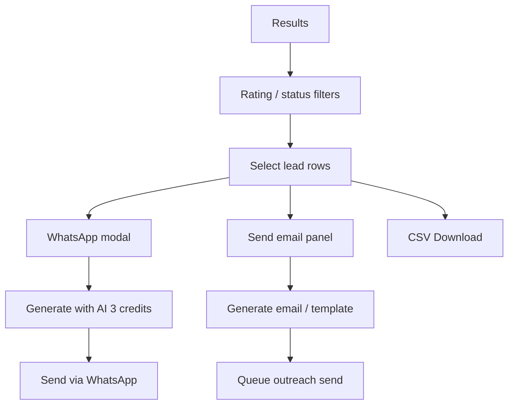
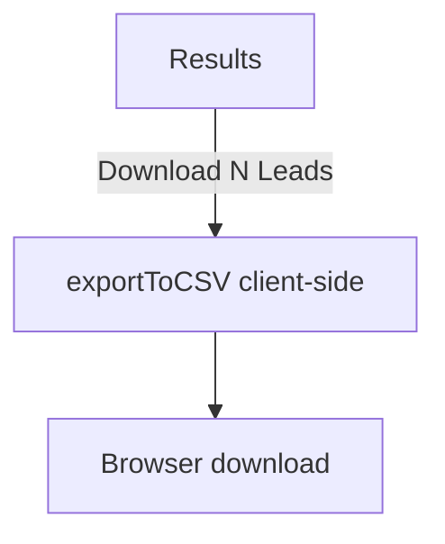
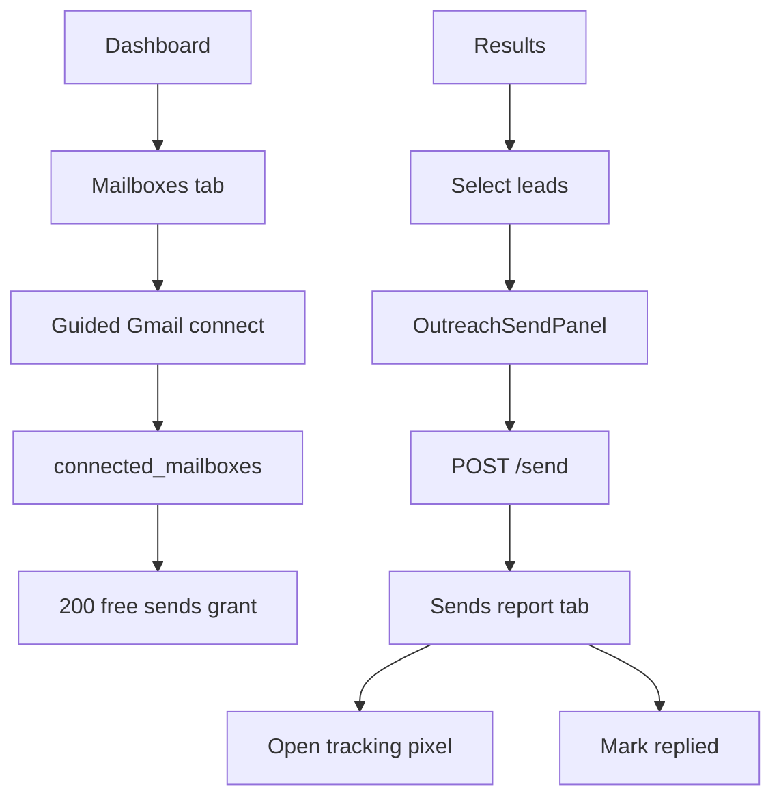
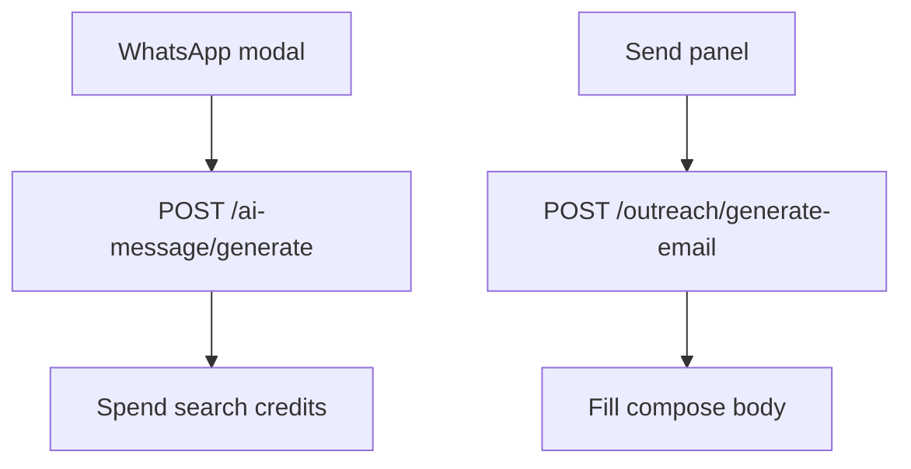
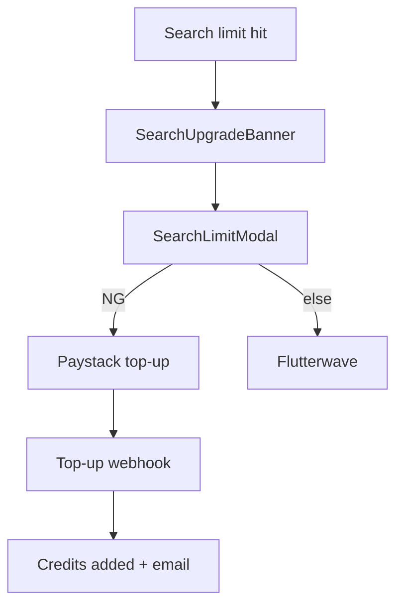
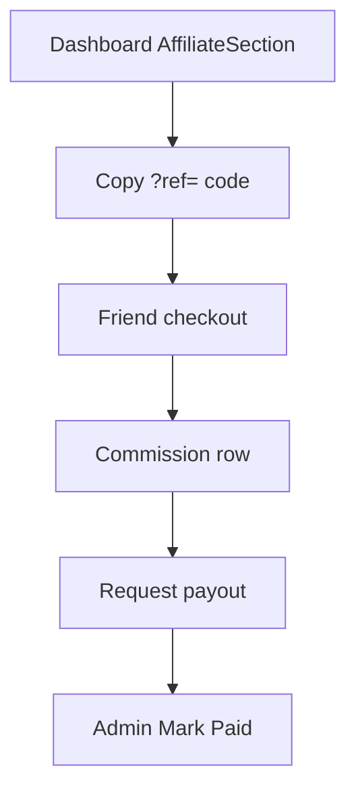

# LeadThur Complete UI & Product Inventory

**Purpose:** Redesign blueprint — every screen, flow, component, email, and asset.

**Method:** Read-only codebase inspection. App code was not modified.

**Screenshots folder:** `docs/ui-audit/screenshots/` (30 PNGs: desktop + mobile).

---


<!-- ========== README.md ========== -->

# LeadThur UI / Product Inventory (Redesign Blueprint)

**Purpose:** Complete UX and product inventory so another team can redesign LeadThur **without opening the source code**.  
**Method:** Read-only inspection of `/Users/donbamz/LeadRush/frontend` (+ email/services for lifecycle).  
**App code modified:** None.  
**Date of capture:** Screenshots from production `https://www.leadthur.com` (desktop 1440×900, mobile 390×844).

---

## Document index

| File | Contents |
|------|----------|
| [01-screen-inventory.md](./01-screen-inventory.md) | Every screen, modal, admin section |
| [02-component-inventory.md](./02-component-inventory.md) | Reusable UI components |
| [03-user-flows.md](./03-user-flows.md) | End-to-end flows + Mermaid |
| [04-navigation.md](./04-navigation.md) | Nav, footer, redirects, protection |
| [05-design-audit.md](./05-design-audit.md) | Visual / UX scores |
| [06-admin-inventory.md](./06-admin-inventory.md) | Admin SPA sections |
| [07-api-to-screen-map.md](./07-api-to-screen-map.md) | APIs per screen |
| [08-database-to-ui-map.md](./08-database-to-ui-map.md) | Tables → UI fields |
| [09-feature-matrix.md](./09-feature-matrix.md) | Feature status matrix |
| [10-assets.md](./10-assets.md) | Logos, images, fonts, video |
| [11-email-templates.md](./11-email-templates.md) | All system emails |
| [12-implementation-notes.md](./12-implementation-notes.md) | Architecture constraints for redesign |
| [screenshots/](./screenshots/) | Desktop + mobile PNGs |

Related deeper engineering doc (optional): `docs/LEADTHUR_COMPLETE_INTERNAL_DOCUMENTATION.md`

---

## Totals

| Metric | Count |
|--------|-------|
| Route pages | 22 |
| Admin SPA sections (incl. login) | 16 |
| Non-route overlays / modals / panels | 8 |
| **Total screens inventoried** | **46** |
| Reusable component files (components + features) | ~80 |
| Unused / orphan components | 4 |
| Drawers / Sheets | **0 (Not Found)** |
| Wizards | 2 (onboarding; mailbox connect) |
| Primary user flows documented | 10 |
| Public screenshot pairs captured | 15 routes × 2 = **30 PNGs** |
| Dialogs (product) | Onboarding, SearchLimit, WhatsApp, Flutterwave, admin confirms; Radix Dialog only on unused ExportModal |
| Forms (major) | Activate, checkout, trial gate, search, top-up, plans, mailbox, admin ops, blog, messaging |
| Admin pages (logical) | 16 sections on one URL |
| API route groups touching UI | ~15 mounts (auth, trial, search, checkout, topup, outreach, admin, public, affiliate, …) |
| DB tables appearing in UI | ~20 (see 08) |

---

## Screenshots

Saved under `docs/ui-audit/screenshots/`:

| Route | Desktop | Mobile | Notes |
|-------|---------|--------|-------|
| `/` | home-desktop.png | home-mobile.png | |
| `/about` | about-*.png | | |
| `/freetrial` | freetrial-*.png | | Email gate / trial UI |
| `/checkout` | checkout-*.png | | |
| `/activate` | activate-*.png | | |
| `/blog` | blog-*.png | | |
| `/privacy` | privacy-*.png | | |
| `/terms` | terms-*.png | | |
| `/payment-success` | payment-success-*.png | | |
| `/checkout/success` | checkout-success-*.png | | |
| `/dashboard` | dashboard-*.png | | **Redirected to `/activate`** (no license) |
| `/dashboard/plans` | dashboard-plans-*.png | | Loaded without license redirect |
| `/admin` | admin-*.png | | Login gate if logged out |
| `/suspended` | suspended-*.png | | |
| `/demo` | demo-*.png | | May show not-found in prod |

**Not captured (auth or dynamic):** full logged-in dashboard, onboarding modal, WhatsApp modal, send panel, blog slug articles, `/demo-recording`, admin logged-in sections. Marked **Not Found** / note in screen inventory.

---

## Biggest UX problems

1. **Cognitive overload on `/dashboard`** — search, results, CRM, WhatsApp, outreach, affiliate, top-up compete in one surface.  
2. **License-key “login”** — unusual mental model vs email/password SaaS.  
3. **Trial UI ≠ paid UI** — two different results systems and paywall patterns.  
4. **No product IA (sidebar)** — tabs buried inside outreach workspace only.  
5. **Inconsistent chrome** — dual Nav/Footer/Logo/fonts (marketing vs app).  
6. **Plans page weakly gated** — `/dashboard/plans` lacks the same client redirect as `/dashboard`.  
7. **Admin is an endless scroll** — no section nav; destructive `window.confirm`.  
8. **Always-dark purple aesthetic** — limited flexibility; accessibility unverified.

---

## Biggest technical risks (affect redesign)

1. Client-only auth gates (localStorage) — UI can show pages APIs reject.  
2. Search is long-running scrape — redesign must keep async progress/SSE model.  
3. Admin site-scripts = full XSS power.  
4. Outreach depends on Gmail app passwords — high setup friction.  
5. Follow-up engine exists in DB/backend with weak first-class UI.

---

## Biggest design opportunities

1. True app shell: Search | Leads | Outreach | Billing | Affiliate | Account.  
2. Unified results component for trial + paid (progressive unlock).  
3. Business detail drawer/page (today: row only).  
4. Onboarding that ends in first successful search, not four tips.  
5. One payment/billing hub (lifetime vs search credits vs outreach).  
6. Design system (type, color, button, modal, drawer, table, form).

---

## Most important screens

1. `/` Marketing home  
2. `/freetrial`  
3. `/checkout`  
4. `/activate`  
5. `/dashboard` (search + results)  
6. Outreach send panel  
7. `/dashboard/plans`  
8. Admin Account Lookup  

## Least important screens

1. `/payment-success` (legacy)  
2. `/get-access`, `/start` (redirects)  
3. `/demo`, `/demo-recording`  
4. Orphan ExportModal  
5. Blog category/tag redirect routes  

---

## Redesign priority

### Phase 1 — Foundations (Critical)

- Design system tokens (type, color, spacing, components)  
- App shell + navigation IA  
- Unify marketing/app brand chrome  
- Redesign Activate + Checkout + Trial conversion path  
- Protect Plans like Dashboard  

### Phase 2 — Core product (High)

- Split Dashboard into Search / Results / Outreach spaces  
- Shared results table/cards + business detail pattern  
- Formal Drawer for compose; Modal system for confirms  
- Onboarding → first search success metric  
- Billing hub (credits + outreach)  

### Phase 3 — Growth & ops (Medium)

- Affiliate as proper page  
- Admin sidebar + safer confirms + script sandboxing  
- Blog visual refresh  
- Email template redesign aligned with product CTAs  

### Phase 4 — Differentiation (Lower)

- Follow-up campaign manager UI  
- Light mode (optional)  
- Password/session auth (product + eng)  
- Remove orphans / legacy routes  

---

## How a designer should work from this pack

1. Read **01** + **03** + **05** first.  
2. Open **screenshots/** for visual baseline.  
3. Use **09** to know what must remain vs cut.  
4. Use **11** for lifecycle email redesign.  
5. Use **12** so mocks respect auth, SSE search, and hosting constraints.  
6. Do **not** invent sidebar/detail pages as “existing” — they are **Not Found** today unless Phase 2 adds them.

---

*End of UI audit README.*


---


<!-- ========== 01-screen-inventory.md ========== -->

# LeadThur UI Audit — Screen Inventory

**Source:** `/Users/donbamz/LeadRush/frontend` (read-only)  
**Screenshots:** `docs/ui-audit/screenshots/`  
**Drawers / Sheets:** Not Found  
**Next.js middleware.ts:** Not Found (gates are client-side)

---

## How to use this file

Each entry is one designer-facing screen: a route page, an admin SPA section, or a modal overlay. Screenshots for auth-gated product states show the gate page that production redirects to when no license is stored.

---

## 1. Marketing Home

| Field | Detail |
|-------|--------|
| **Screen Name** | Marketing Home |
| **URL** | `/` |
| **Purpose** | Public landing: problem → product → social proof → pricing → CTA |
| **User Type** | Guest |
| **Navigation Path** | Direct / marketing Nav / Footer |
| **Screenshot** | `screenshots/home-desktop.png`, `screenshots/home-mobile.png` |
| **Files Used** | `frontend/app/(marketing)/page.tsx`, `frontend/app/(marketing)/layout.tsx` |
| **React Components** | AnnouncementBar, Nav, Hero, StatsBar, ProblemAgitationSection, FreeTrialInviteSection, EmailSenderSection, DemoVideoSection, UserTestimonialsSection, TrustpilotSection, HowItWorksSection, DifferenceSection, FeatureGridSection, PricingSection, GuaranteeSection, WhoIsForSection, FAQSection, FinalCTASection, Footer |
| **Hooks** | Not Found (composition only) |
| **API Endpoints** | `GET /public/site-scripts` (via root layout) |
| **Database Tables** | `site_settings` (scripts), `blog_posts` (indirect via site) |
| **Primary CTA** | `Get My Client List Now` / `Claim My Lifetime Access` → `#offer` or `/checkout` |
| **Secondary CTA** | `Try Free` → `/freetrial`; `Login` → `/activate` |
| **Forms** | Not Found |
| **Filters** | Not Found |
| **Tables** | Not Found |
| **Cards** | Feature / pricing / testimonial cards |
| **Charts** | Not Found |
| **Dialogs** | Not Found |
| **Drawers** | Not Found |
| **Tabs** | Not Found |
| **Dropdowns** | Not Found |
| **Tooltips** | Not Found |
| **Loading States** | Not Found (static) |
| **Empty States** | Not Found |
| **Error States** | Not Found |
| **Success States** | Not Found |
| **Responsive Behaviour** | Clamp typography; full-width CTAs; TAP_TARGET ≥48px |
| **Accessibility Issues** | Dark marketing site; FAQ accordion — keyboard details not verified in audit |
| **Current UX Problems** | Long single-page scroll; multiple competing CTAs; scarcity copy vs product reality |
| **Suggested Priority** | Critical (acquisition surface) |

---

## 2. Free Trial

| Field | Detail |
|-------|--------|
| **Screen Name** | Free Trial Search |
| **URL** | `/freetrial` |
| **Purpose** | Email-gated 2 free searches; blurred emails; convert to lifetime |
| **User Type** | Guest → Trial |
| **Navigation Path** | Marketing “Try Free” / Final CTA / Blog CTAs |
| **Screenshot** | `screenshots/freetrial-desktop.png`, `screenshots/freetrial-mobile.png` |
| **Files Used** | `frontend/app/freetrial/page.tsx`, `frontend/app/freetrial/layout.tsx` |
| **React Components** | Inline: PaywallValueRow, TrialPhoneValue, LockedContactValue, StarRating, TrialSearchGuidance, TrialExamplePills, TrialSearchHint, LeadRowMobile |
| **Hooks** | useState, useEffect, useCallback, useMemo, useRef |
| **API Endpoints** | `GET /trial/status`, `POST /trial/signup`, `POST /freetrial`, `GET /search/results/:id?trialEmail=` |
| **Database Tables** | `free_trial_signups`, `free_trial_ip_usage`, `search_jobs`, `business_leads` |
| **Primary CTA** | `Start My 2 Free Searches` → `Run free search` → `Get lifetime access for $X` |
| **Secondary CTA** | `Get Full Access`; `Start fresh with a different email` |
| **Forms** | Email gate; business type + location search |
| **Filters** | Not Found (trial shows capped rows) |
| **Tables** | Desktop results grid; mobile cards |
| **Cards** | Mobile lead cards; paywall value rows |
| **Charts** | Not Found |
| **Dialogs** | Not Found (fixed bottom paywall panel) |
| **Drawers** | Not Found |
| **Tabs** | Not Found |
| **Dropdowns** | Not Found |
| **Tooltips** | Not Found |
| **Loading States** | `Loading your free trial...`; `Searching...` |
| **Empty States** | Invalid search guidance / example pills |
| **Error States** | Gate/search validation messages; IP/email limit |
| **Success States** | Partial results with blurred fields |
| **Responsive Behaviour** | `md:hidden` cards / `hidden md:block` table; fixed bottom paywall |
| **Accessibility Issues** | Blurred/locked content may confuse screen readers |
| **Current UX Problems** | Paywall aggressive; emails blurred; separate from paid dashboard UX |
| **Suggested Priority** | Critical |

---

## 3. Checkout (Lifetime)

| Field | Detail |
|-------|--------|
| **Screen Name** | Lifetime Checkout |
| **URL** | `/checkout` |
| **Purpose** | Collect email; Paystack (NG) or Flutterwave (elsewhere) |
| **User Type** | Guest |
| **Navigation Path** | Pricing CTAs / `/get-access` / `/start` redirects |
| **Screenshot** | `screenshots/checkout-desktop.png`, `screenshots/checkout-mobile.png` |
| **Files Used** | `frontend/app/checkout/page.tsx`, `layout.tsx` |
| **React Components** | Inline card UI; Flutterwave SDK modal |
| **Hooks** | useState, useEffect, useMemo, useFlutterwave |
| **API Endpoints** | `POST /checkout/initialize`; Flutterwave client-side |
| **Database Tables** | Creates `license_keys` after webhook (not on screen) |
| **Primary CTA** | `Claim My Lifetime Access - $X` |
| **Secondary CTA** | Not Found |
| **Forms** | Email |
| **Filters / Tables / Cards / Charts** | Single checkout card |
| **Dialogs** | Flutterwave payment overlay (third-party) |
| **Drawers / Tabs / Dropdowns / Tooltips** | Not Found |
| **Loading States** | `Detecting your location...`; `Opening payment...` |
| **Empty / Error / Success** | Invalid email; payment failed; success redirects |
| **Responsive Behaviour** | Centered max-width ~480; 48px tap targets |
| **Accessibility Issues** | Third-party modal a11y depends on Flutterwave |
| **Current UX Problems** | Dual gateways by country may confuse; sparse trust UI on page |
| **Suggested Priority** | Critical |

---

## 4. Checkout Success

| Field | Detail |
|-------|--------|
| **Screen Name** | Checkout Success |
| **URL** | `/checkout/success` |
| **Purpose** | Verify lifetime payment or outreach Paystack return |
| **User Type** | Guest (post-pay); Paid (outreach return) |
| **Navigation Path** | Payment gateway return URL |
| **Screenshot** | `screenshots/checkout-success-desktop.png`, `screenshots/checkout-success-mobile.png` |
| **Files Used** | `frontend/app/checkout/success/page.tsx` |
| **React Components** | Inline; Suspense |
| **Hooks** | useSearchParams, useState, useEffect |
| **API Endpoints** | `POST /checkout/verify`; `fetchOutreachBalance()` |
| **Database Tables** | `license_keys`, `outreach_accounts` (via verify) |
| **Primary CTA** | `Activate My Account →` or `Back to Outreach Billing →` |
| **Secondary CTA** | `Back to leadthur.com` / `Back to dashboard` |
| **Forms / Filters / Tables** | Not Found |
| **Dialogs / Drawers** | Not Found |
| **Loading / Error / Success** | Loading / ok / warn texts for license or balance |
| **Responsive Behaviour** | Centered card |
| **Current UX Problems** | Dual success paths (lifetime vs outreach) on one URL |
| **Suggested Priority** | High |

---

## 5. Payment Success (Legacy)

| Field | Detail |
|-------|--------|
| **Screen Name** | Payment Success (static) |
| **URL** | `/payment-success` |
| **Purpose** | Simple “check email” confirmation |
| **User Type** | Guest |
| **Screenshot** | `screenshots/payment-success-desktop.png`, `screenshots/payment-success-mobile.png` |
| **Files Used** | `frontend/app/payment-success/page.tsx` |
| **API Endpoints** | Not Found |
| **Primary CTA** | Not Found (WhatsApp number in copy) |
| **Current UX Problems** | Overlaps `/checkout/success`; likely legacy |
| **Suggested Priority** | Low |

---

## 6. Activate / Login

| Field | Detail |
|-------|--------|
| **Screen Name** | Activate (License Login) |
| **URL** | `/activate` |
| **Purpose** | Email + license key → store credentials → dashboard |
| **User Type** | Guest → Paid |
| **Navigation Path** | Nav Login; post-purchase email; dashboard gate redirect |
| **Screenshot** | `screenshots/activate-desktop.png`, `screenshots/activate-mobile.png` |
| **Files Used** | `frontend/app/activate/page.tsx`, `layout.tsx` |
| **React Components** | Inline form |
| **Hooks** | useRouter, useSearchParams, useState, useEffect |
| **API Endpoints** | `POST /auth/activate` via `activateLicense()` |
| **Database Tables** | `license_keys` (device slots) |
| **Primary CTA** | `Log in` / `Signing in…` |
| **Secondary CTA** | Not Found |
| **Forms** | Email, License key (`?key=` prefill) |
| **Loading / Error / Success** | Signing in; max_devices error; failure alert; redirect |
| **Responsive Behaviour** | `max-w-md` centered |
| **Current UX Problems** | “Login” is license-key activation — unusual mental model |
| **Suggested Priority** | Critical |

---

## 7. Dashboard (Paid Product)

| Field | Detail |
|-------|--------|
| **Screen Name** | Dashboard — Search & Outreach |
| **URL** | `/dashboard` |
| **Purpose** | Core product: search, results, export, WhatsApp AI, email outreach, affiliate |
| **User Type** | Paid (license). Suspended → `/suspended`. Demo `?demo=recording` bypasses license. |
| **Navigation Path** | Activate success; Navbar Dashboard CTA |
| **Screenshot** | `screenshots/dashboard-desktop.png`, `screenshots/dashboard-mobile.png` *(production redirect → `/activate` without license; captures gate)* |
| **Files Used** | `app/dashboard/page.tsx`, `dashboard-gate.tsx`, `dashboard-router.tsx`, `search-dashboard.tsx` |
| **React Components** | SearchUpgradeBanner, AffiliateSection, WelcomeState, OutreachWorkspace, ResultsTable, DashboardHistorySections, OnboardingModal, SearchLimitModal, WhatsappTemplateModal, Navbar, Footer |
| **Hooks** | useSearch, useOutreach, useLeadStatuses, useIsMobile |
| **API Endpoints** | `GET /auth/status`; search start/poll/stream; usage; suggestions; activity; outreach balance/mailboxes/send; WhatsApp templates; AI message; affiliate stats |
| **Database Tables** | `license_keys`, `search_jobs`, `business_leads`, `search_history`, `user_searches`, `lead_statuses`, `whatsapp_templates`, `ai_message_log`, outreach tables, `commissions` |
| **Primary CTA** | `Search`; `Download N Leads`; `Send email (N)` |
| **Secondary CTA** | Clear Results; Top Up; Try Again; city chips; Affiliate copy link |
| **Forms** | Business type + location |
| **Filters** | Rating filter; lead status filter |
| **Tables** | ResultsTable (virtualized); mobile MobileLeadCard |
| **Cards** | Queue card; welcome examples; mailbox cards |
| **Charts** | Not Found |
| **Dialogs** | OnboardingModal, SearchLimitModal, WhatsappTemplateModal |
| **Drawers** | Not Found (OutreachSendPanel is fixed slide-over) |
| **Tabs** | Results / Sends report / Mailboxes |
| **Dropdowns** | Lead status select |
| **Tooltips** | Not Found (contact dots may imply status) |
| **Loading States** | Searching progress; queue position; stream leads |
| **Empty States** | WelcomeState examples; `No potential clients…` |
| **Error States** | Search failed; limit reached; top-up errors |
| **Success States** | Search complete; top-up success banner; send success banner |
| **Responsive Behaviour** | useIsMobile; mobile cards; full-width actions; send panel fullscreen mobile |
| **Accessibility Issues** | Dense UI; heavy table; modal focus traps depend on Radix Dialog usage |
| **Current UX Problems** | Single page does search + CRM + outreach + affiliate; cognitive overload |
| **Suggested Priority** | Critical |

---

## 8. Search Result by ID

| Field | Detail |
|-------|--------|
| **Screen Name** | Persisted Search Results |
| **URL** | `/dashboard/search/[searchId]` |
| **Purpose** | Reopen a past search with outreach tooling |
| **User Type** | Paid |
| **Screenshot** | Not Found as dedicated capture (auth). Behavior same as dashboard results subset. |
| **Files Used** | `app/dashboard/search/[searchId]/page.tsx`, `search-result-client.tsx` |
| **Components** | Navbar, Footer, OutreachWorkspace, ResultsTable, NearbyCityChips, ResultsActionsBar, DashboardHistorySections, WhatsappTemplateModal |
| **Hooks** | useParams, useRouter, useSearchJob, useOutreach, useLeadStatuses, useIsMobile |
| **API Endpoints** | `GET /search/:id`, results/stream; outreach APIs |
| **Primary CTA** | Same as dashboard results |
| **Suggested Priority** | High |

---

## 9. Outreach Plans / Billing

| Field | Detail |
|-------|--------|
| **Screen Name** | Outreach Plans |
| **URL** | `/dashboard/plans` |
| **Purpose** | Buy outreach subscription or credit packs (not search credits) |
| **User Type** | Intended Paid — **no page-level license redirect found** |
| **Screenshot** | `screenshots/dashboard-plans-desktop.png`, `screenshots/dashboard-plans-mobile.png` |
| **Files Used** | `frontend/app/dashboard/plans/page.tsx` |
| **Hooks** | useOutreach, useMemo, useState |
| **API Endpoints** | Outreach checkout initialize; `GET /balance/` |
| **Database Tables** | `outreach_accounts`, `outreach_paystack_plans`, credit transactions |
| **Primary CTA** | `Subscribe` / `Buy credits` |
| **Secondary CTA** | `Back to dashboard` |
| **Cards** | 3 subscription + 3 pack cards; balance stats |
| **Current UX Problems** | Missing hard auth gate; “plans” naming vs search top-ups confusion |
| **Suggested Priority** | High |

---

## 10. Admin Console (shell)

| Field | Detail |
|-------|--------|
| **Screen Name** | Admin Console |
| **URL** | `/admin` |
| **Purpose** | Ops: licenses, trials, payouts, messaging, blog, scripts |
| **User Type** | Admin |
| **Screenshot** | `screenshots/admin-desktop.png`, `screenshots/admin-mobile.png` (login gate if no token) |
| **Files Used** | `frontend/app/admin/page.tsx`, `components/admin/*` |
| **Primary CTA** | `Sign in` |
| **Suggested Priority** | High |

### Admin SPA sections (count as screens)

| # | Section | Purpose | Priority |
|---|---------|---------|----------|
| 10a | Admin Login | Email/password → JWT | Critical |
| 10b | Queue Status Bar | Live search queue metrics | Medium |
| 10c | Activation Tracker | Signup/activation chart | Medium |
| 10d | Global Scripts | head/body script injection | High (security-sensitive) |
| 10e | Overview KPIs | Stat cards | Medium |
| 10f | Recent Users | Last signups table | Medium |
| 10g | Affiliate Payouts | Processing / Mark Paid | High |
| 10h | Free Trial Activity | Collapsible trial KPIs | Medium |
| 10i | Trial Signups | Signup list | Medium |
| 10j | Email Performance | Sequence open rates | Medium |
| 10k | Trial Broadcast | One-off trial emails | Medium |
| 10l | Account Lookup | License manage actions | Critical |
| 10m | Direct Messaging | Single / broadcast HTML email | High |
| 10n | Blog Manager | CMS list + editor | High |
| 10o | Generate Access | Manual license grant | High |
| 10p | Recent Licenses | License inventory table | Medium |

---

## 11. Suspended

| Field | Detail |
|-------|--------|
| **Screen Name** | Suspended Account |
| **URL** | `/suspended` |
| **Purpose** | Blocked account holding; poll for restore |
| **User Type** | Paid (suspended) |
| **Screenshot** | `screenshots/suspended-desktop.png`, `screenshots/suspended-mobile.png` |
| **Primary CTA** | `Contact Support on WhatsApp` |
| **API** | `GET /auth/status` every 10s |
| **Suggested Priority** | Medium |

---

## 12. About

| Field | Detail |
|-------|--------|
| **URL** | `/about` |
| **User Type** | Guest |
| **Screenshot** | `screenshots/about-desktop.png`, `screenshots/about-mobile.png` |
| **Primary CTA** | `Try LeadThur Free →` |
| **Suggested Priority** | Low |

---

## 13. Privacy

| Field | Detail |
|-------|--------|
| **URL** | `/privacy` |
| **Screenshot** | `screenshots/privacy-desktop.png`, `screenshots/privacy-mobile.png` |
| **Suggested Priority** | Low |

---

## 14. Terms

| Field | Detail |
|-------|--------|
| **URL** | `/terms` |
| **Screenshot** | `screenshots/terms-desktop.png`, `screenshots/terms-mobile.png` |
| **Suggested Priority** | Low |

---

## 15. Blog Index

| Field | Detail |
|-------|--------|
| **URL** | `/blog` |
| **Screenshot** | `screenshots/blog-desktop.png`, `screenshots/blog-mobile.png` |
| **API** | `GET /public/blog/posts` |
| **Tables / Cards** | Post card grid; category pills |
| **Suggested Priority** | Medium |

---

## 16. Blog Post

| Field | Detail |
|-------|--------|
| **URL** | `/blog/[slug]` |
| **Screenshot** | Not Found (slug-dependent; capture per article during redesign) |
| **Components** | blog-article-view, blog-post-card |
| **Suggested Priority** | Medium |

---

## 17–18. Blog Category / Tag Redirects

| URL | Behavior | Screenshot |
|-----|----------|------------|
| `/blog/category/[slug]` | → `/blog?category=` | Not Found (instant redirect) |
| `/blog/tag/[slug]` | → `/blog?tag=` | Not Found (instant redirect) |

**Suggested Priority:** Low

---

## 19–20. Redirect Stubs

| URL | Target | Screenshot |
|-----|--------|------------|
| `/get-access` | `/checkout` | Not Found (instant redirect) |
| `/start` | `/checkout` | Not Found (instant redirect) |

---

## 21. Demo

| Field | Detail |
|-------|--------|
| **URL** | `/demo` |
| **Access** | Staging / `DEMO_MODE` / development; else “Page not found.” |
| **Screenshot** | `screenshots/demo-desktop.png`, `screenshots/demo-mobile.png` |
| **Suggested Priority** | Low (sales tooling) |

---

## 22. Demo Recording

| Field | Detail |
|-------|--------|
| **URL** | `/demo-recording` |
| **Purpose** | Auto-play dashboard mock for recordings |
| **Component** | DemoRecordingDashboard |
| **Screenshot** | Not Found (not captured in this run) |
| **Suggested Priority** | Low |

---

## Non-route overlays (count as screens)

### Onboarding Modal

| Field | Detail |
|-------|--------|
| **Name** | OnboardingModal |
| **URL** | Overlay on `/dashboard` |
| **Purpose** | 4-step first-run: Welcome → business → city → watch results |
| **CTAs** | `Next →` / `Got it. Let me search →`; `Skip` |
| **Screenshot** | Not Found (requires paid session + first visit) |
| **File** | `components/dashboard/onboarding-modal.tsx` |
| **Priority** | High |

### Search Limit / Top-up Modal

| Field | Detail |
|-------|--------|
| **Name** | SearchLimitModal |
| **Purpose** | Sell search credit packs when limit hit |
| **CTAs** | Per-tier `Top Up Now` |
| **API** | `/topup/initialize`, `/topup/initialize-flw` |
| **Screenshot** | Not Found (requires paid limit state) |
| **Priority** | High |

### WhatsApp Template Modal

| Field | Detail |
|-------|--------|
| **Name** | WhatsappTemplateModal |
| **Purpose** | Niche templates + AI generate + open WhatsApp |
| **File** | `whatsapp-template-modal.tsx` |
| **Screenshot** | Not Found (requires results + click) |
| **Priority** | High |

### Outreach Send Panel (slide-over)

| Field | Detail |
|-------|--------|
| **Name** | OutreachSendPanel |
| **Purpose** | Compose AI/template email; queue send |
| **Not** | Dialog / Drawer (fixed panel; full-screen mobile) |
| **Screenshot** | Not Found (requires selection) |
| **Priority** | Critical |

### Export Modal

| Field | Detail |
|-------|--------|
| **Name** | ExportModal |
| **Status** | **Unused / orphan** — CSV exports directly |
| **File** | `export-modal.tsx` |
| **Priority** | Low (remove or wire up) |

### Flutterwave Payment Overlay

| Field | Detail |
|-------|--------|
| **Name** | Flutterwave SDK modal |
| **Used on** | Checkout, SearchLimitModal |
| **Priority** | High |

### Admin confirm overlays

Trial broadcast confirm modal; `window.confirm` for payouts, delete blog, broadcast; Account Lookup inline Confirm Suspend / Reset.

---

## Totals

| Metric | Count |
|--------|-------|
| Route pages (`page.tsx`) | 22 |
| Admin SPA sections (incl. login) | 16 |
| Non-route modals / overlays (incl. orphan ExportModal) | 8 |
| **Total inventoried screens** | **46** |
| Drawers / Sheets | 0 (Not Found) |
| Wizards | 2 (Onboarding 4-step; Guided mailbox connect) |
| Desktop+mobile screenshot pairs captured | 15 routes (30 PNGs) |

### Screenshot notes

- `/dashboard` without license redirects to `/activate` — screenshots show activate gate.
- `/dashboard/plans` loaded without redirect (auth gap).
- Auth-only states (full dashboard, onboarding, WhatsApp modal, send panel): screenshot Not Found in this capture set.


---


<!-- ========== 02-component-inventory.md ========== -->

# LeadThur UI Audit — Component Inventory

**Source:** `frontend/components/**`, `frontend/features/**`  
**Rule:** Based on imports found in the repo. Orphans noted.

---

## Primitives (`components/ui/`)

| Component | Purpose | Props / Variants | Used On | A11y | Problems |
|-----------|---------|------------------|---------|------|----------|
| Button | Primary actions | `variant`, `size` (CVA) | Dashboard, outreach, navbar | Depends on Radix/slot | Fine |
| Dialog | Modal shell (Radix) | DialogContent/Header/Title/Description | export-modal only | Radix focus trap | Underused |
| Input | Text field | standard | Outreach, demo-recording | Native | Fine |
| Progress | Progress bar | standard | search-dashboard, demo-recording | Limited | Fine |

---

## App shell

| Component | Purpose | Props | Used On | Problems |
|-----------|---------|-------|---------|----------|
| navbar | App top bar logo + Dashboard | none | dashboard-gate, search result page | Logo “LP” vs marketing “LT” inconsistency |
| footer | Legal links | none | dashboard-gate, search result page | Duplicate of marketing Footer |

---

## Marketing (`components/marketing/homepage/`)

| Component | Purpose | Used On | Problems |
|-----------|---------|---------|----------|
| theme.ts | Colors, FONT, route consts | All homepage sections | System font ≠ Inter in app layout |
| Nav | Sticky marketing nav | Marketing home | Duplicate of navbar |
| Footer | Marketing footer | Marketing home | No About link (app footer has About) |
| LeadThurLogo | LT badge logo | Nav, Footer | Third logo treatment vs `/logo.png` |
| AnnouncementBar | Top strip | Home | — |
| Hero | Hero | Home | — |
| StatsBar | Stats | Home | — |
| ProblemAgitationSection | Problem | Home | — |
| FreeTrialInviteSection | Trial CTA | Home | — |
| EmailSenderSection | Outreach pitch | Home | — |
| DemoVideoSection | YouTube embed | Home | External dependency |
| UserTestimonialsSection | Testimonials | Home | — |
| TrustpilotSection | Trustpilot images | Home | Static PNGs |
| HowItWorksSection | How it works | Home | — |
| DifferenceSection | Differentiation | Home | — |
| FeatureGridSection | Features | Home | — |
| WhoIsForSection | Audience | Home | — |
| PricingSection | Pricing | Home | — |
| GuaranteeSection | Guarantee | Home | — |
| FAQSection | FAQ accordion | Home | — |
| FinalCTASection | Closing CTA | Home | — |

**Props:** Marketing sections take no props (hardcoded copy).

---

## Dashboard core

| Component | Purpose | Key props | Used On | Problems |
|-----------|---------|-----------|---------|----------|
| dashboard-gate | License gate | none | dashboard page | Client-only auth |
| dashboard-router | Demo vs real | `skipAccessCheck?` | gate | — |
| search-dashboard | Main product UX | none | router | Monolith |
| demo-recording-dashboard | Recording mock | none | router, demo-recording | — |
| welcome-state | Empty examples | `onExampleSearch` | search-dashboard | — |
| live-counter | Animated count | `count`, `isSearching` | search-dashboard | — |
| search-queue-card | Queue position | `queuePosition` | search-dashboard | — |
| region-city-chips | Soft city suggestions | suggestions, onSelect | search-dashboard | — |
| nearby-city-chips | Nearby cities | cities, show, onSelect | dashboard, result page | Hardcoded city list (backend) |
| results-summary-bar | Contact stats | `leads` | result page | — |
| results-actions-bar | Download/clear | exportCount, handlers | dashboard, result | — |
| dashboard-history-sections | History wrapper | isMobile, refreshKey | dashboard, result | — |
| search-history | Past searches | isMobile, refreshKey | history sections | Dual history systems |
| recent-searches-panel | Recent + search again | refreshKey, onSearchAgain | history sections | — |
| onboarding-modal | 4-step onboarding | open, step, onNext, onSkip | dashboard page | localStorage only |
| affiliate-section | Referral UI | none | search-dashboard | Nested in search UI |
| SearchUpgradeBanner | Limit banner | remaining, onUpgradeClick | search-dashboard | — |
| SearchLimitModal | Top-up modal | email, onClose | search-dashboard | — |
| RichEmailEditor | TipTap HTML | value, onChange | admin blog, messaging | Admin only |

---

## Results / leads

| Component | Purpose | Key props | Used On | Problems |
|-----------|---------|-----------|---------|----------|
| features/results/results-table | Live virtualized table | leads, filters, selection, outreach | dashboard, result, demo | Large surface |
| features/export/csv-export | CSV helpers | exportToCSV | dashboard, history, api | — |
| email-cell | Email display/copy | lead, onCopy | results-table | — |
| copy-button | Clipboard | value, copyId | email-cell, mobile card | — |
| website-link | Truncated URL | website | cards/table | — |
| contact-dots | Presence indicators | lead | results-table | Meaning not labeled |
| mobile-lead-card | Mobile row | lead, handlers | results-table | — |
| lead-status-select | Pipeline status | leadId, status, onChange | cards/table | — |
| pipeline-summary | Status filter chips | leads, filter, onChange | results-table | — |
| rating-filter | Star filter | value, onChange | results-table | — |
| whatsapp-template-modal | WA + AI | lead, email, credits | dashboard, result, demo | — |
| leads-table | Older table | leads, isLoading | **Unused** | Duplicate / orphan |
| export-modal | Export dialog | open, count, onDownload | **Unused** | Orphan |

---

## Outreach

| Component | Purpose | Key props | Used On | Problems |
|-----------|---------|-----------|---------|----------|
| outreach-workspace | Tabs: Results/Sends/Mailboxes | large prop surface | dashboard, result | Complex |
| outreach-section | Deprecated alias | — | re-export | Dead alias |
| results-outreach-shell | Deprecated alias | — | **Unused** | Orphan |
| outreach-top-bar | Balance summary | balance, mailboxes | workspace | — |
| outreach-search-box | Search inputs | fields + handlers | workspace | — |
| outreach-mailbox-section | Mailbox manage | mailboxes, max, onChanged | workspace | — |
| outreach-guided-mailbox-connect | Gmail connect wizard | onConnected, onCancel | mailbox section | Wizard |
| outreach-send-panel | Compose + send | open, selectedLeads, … | workspace, demo | Not a drawer |
| outreach-send-success-banner | Post-send | result, onDismiss | workspace | — |
| outreach-sends-report | Sends history | refreshKey, isActive | workspace | — |
| outreach-balance-banner | Balance banner | balance, hasMailbox | **Unused** | Orphan |

---

## Admin

| Component | Purpose | Props | Used On |
|-----------|---------|-------|---------|
| account-lookup | License ops | onSessionExpired, prefillEmail | admin page |
| blog-manager | Blog CMS | — | admin page |
| direct-messaging | HTML email send | onSessionExpired | admin page |
| queue-status-bar | Queue metrics | enabled | admin page |
| trial-insights-tabs | Trial tabs shell | onSessionExpired | admin page |
| trial-signups-panel | Signups table | onSessionExpired | insights |
| trial-email-performance-panel | Open rates | onSessionExpired | insights |
| trial-broadcast-panel | Broadcast composer | onSessionExpired | admin page |

---

## Blog

| Component | Purpose | Props | Used On |
|-----------|---------|-------|---------|
| blog-article-view | Article + related | post, content, headings, related | blog/[slug] |
| blog-post-card | Card | post, variant | blog index, article |

---

## Duplicate components

| Pair | Recommendation for redesign |
|------|-----------------------------|
| `navbar` vs marketing `Nav` | Unify design system nav with context variants |
| `footer` vs marketing `Footer` | Unify; include consistent legal + About |
| `leads-table` vs `results-table` | Delete leads-table |
| Logo LP / LT / logo.png | One brand mark |
| Deprecated outreach aliases | Delete |

## Unused components

- `export-modal.tsx`
- `leads-table.tsx`
- `outreach-balance-banner.tsx`
- `results-outreach-shell.tsx`

## Accessibility (cross-cutting)

- Dark-only UI; contrast not systematically audited
- Contact dots / icons lack visible text alternatives in places
- Modal a11y: Radix Dialog only used by unused ExportModal; custom modals may lack focus trap
- Tables: virtualized — ensure header associations for redesign

## Totals

| Metric | Count |
|--------|-------|
| Component files under components/ + features/ | ~80 |
| Unused / orphan | 4 |
| Deprecated re-exports | 2 |
| Marketing sections | 18 |
| Admin panels | 8 |


---


<!-- ========== 03-user-flows.md ========== -->

# LeadThur UI Audit — User Flows

**Source:** Frontend routes + backend fulfillment/search/outreach code paths.

---

## Flow A — Acquisition (Landing → Trial → Upgrade)

```mermaid
flowchart TD
  L[Landing /] -->|Try Free| FT[/freetrial email gate]
  L -->|Claim Lifetime| CO[/checkout]
  FT -->|Start My 2 Free Searches| TS[Trial signup API]
  TS --> S1[Run free search]
  S1 --> R1[Blurred results]
  R1 -->|2nd search or scroll paywall| PW[Get lifetime access]
  PW --> CO
  CO -->|Paystack/Flutterwave| WH[Webhook fulfillment]
  WH --> EM[Activation email]
  EM --> ACT[/activate]
```

**Screens:** Home, Free Trial, Checkout, Checkout Success / Payment Success, Activate  
**Drop-offs:** Email gate friction; paywall before value fully felt; dual success URLs

---

## Flow B — Activation → First Search

```mermaid
flowchart TD
  ACT[/activate] -->|email + key| AUTH[POST /auth/activate]
  AUTH --> LS[localStorage license]
  LS --> D[/dashboard]
  D -->|OnboardingModal if first visit| OB[4 steps]
  OB --> W[WelcomeState examples]
  W --> SR[Search business + city]
  SR --> Q[Queue / SSE stream]
  Q --> RES[Results table]
```

**Screens:** Activate, Dashboard, Onboarding Modal, Welcome State, Results  
**Permissions:** Paid license required (client gate)

---

## Flow C — Lead Discovery → Business Actions



**Screens:** Dashboard Results tab, WhatsApp Modal, Outreach Send Panel  
**Business detail page:** Not Found (no dedicated detail route — row/card only)

---

## Flow D — Export



**ExportModal:** Not Found in live path (component unused)

---

## Flow E — Outreach Setup → Campaign



**Billing side path:** `/dashboard/plans` → Paystack subscription/pack → `/checkout/success`

---

## Flow F — AI Assist



**Provider:** DeepSeek (backend)

---

## Flow G — Search Credits Billing



---

## Flow H — Affiliate



---

## Flow I — Admin Ops

```mermaid
flowchart TD
  A[/admin login] --> JWT[Admin JWT]
  JWT --> LOOK[Account Lookup]
  JWT --> GEN[Generate Access]
  JWT --> MSG[Direct Messaging / Broadcast]
  JWT --> BLOG[Blog Manager]
  JWT --> PAY[Payouts]
  JWT --> TRIAL[Trial insights / broadcast]
  JWT --> SCR[Site scripts]
```

---

## Flow J — Suspension

```mermaid
flowchart TD
  D[Dashboard poll /auth/status] -->|SUSPENDED| S[/suspended]
  S -->|Contact WhatsApp| SUP[Support]
  S -->|poll valid| D2[/dashboard]
```

---

## Flow summary table

| Flow | Entry | Exit success | Key risk |
|------|-------|--------------|----------|
| Acquisition | `/` | License email | Trial→paywall conversion |
| Activation | `/activate` | First search | License UX confusion |
| Discovery | Dashboard search | Results | Scrape time / empty |
| Export | Download | CSV file | No confirmation modal live |
| Outreach | Mailbox connect | Sent + tracked | Gmail app password friction |
| AI | Modal/panel | Message ready | Credit cost surprise |
| Billing search | Limit modal | Credits | Dual gateways |
| Billing outreach | `/dashboard/plans` | Balance up | Weak page auth |
| Affiliate | Dashboard section | Payout | Manual admin pay |
| Admin | `/admin` | Ops done | Script injection power |

**Total documented user flows:** 10 primary (A–J)


---


<!-- ========== 04-navigation.md ========== -->

# LeadThur UI Audit — Navigation

---

## Top Navigation

### Marketing (`components/marketing/homepage/Nav.tsx`)

| Item | Target |
|------|--------|
| How It Works | `#how-it-works` |
| Features | `#features` |
| Reviews | (section scroll) |
| Offer | `#offer` |
| FAQ | `#faq` |
| Log in | `/activate` |
| Try Free | `https://www.leadthur.com/freetrial` |
| Get Lifetime Access | `/checkout` |

Also: AnnouncementBar above nav on homepage.

### App shell (`components/navbar.tsx`)

| Item | Target |
|------|--------|
| Logo / LeadThur | `/` |
| Dashboard CTA | `/dashboard` |

Used on: dashboard gate, search result page.

### Free trial header

Inline “Get Full Access” (not shared Nav component) — see `freetrial/page.tsx`.

### Admin

No shared top nav component. Single-page vertical sections after login; Logout control on page.

---

## Sidebar

**Not Found.** No app sidebar navigation. Product is a single dense dashboard with outreach **tabs** (Results / Sends report / Mailboxes), not a sidebar IA.

---

## Footer

### Marketing Footer (`marketing/homepage/Footer.tsx`)

| Link | Target |
|------|--------|
| Log in | `/activate` |
| Support | `mailto:support@leadthur.com` |
| Privacy | `/privacy` |
| Terms | `/terms` |

About: **Not Found** in marketing footer.

### App Footer (`components/footer.tsx`)

| Link | Target |
|------|--------|
| Privacy | `/privacy` |
| Terms | `/terms` |
| About | `/about` |

---

## Admin Navigation

**Not Found** as discrete nav. `/admin` is one long SPA with sequential sections:

1. Queue status  
2. Activation tracker  
3. Global scripts  
4. Overview  
5. Recent users  
6. Affiliate payouts  
7. Free trial activity  
8. Trial insights tabs  
9. Broadcast  
10. Account lookup  
11. Direct messaging  
12. Blog manager  
13. Generate access  
14. Recent licenses  

---

## Breadcrumbs

**Not Found.**

---

## Hidden / Disallowed Routes

From `frontend/app/robots.ts`:

| Path | robots |
|------|--------|
| `/admin` | Disallow |
| `/activate` | Disallow |
| `/dashboard` | Disallow |
| `/demo` | Disallow |

Still reachable by URL.

---

## Redirects

| From | To | File |
|------|----|------|
| `/get-access` | `/checkout` | `app/get-access/page.tsx` |
| `/start` | `/checkout` | `app/start/page.tsx` |
| `/blog/category/[slug]` | `/blog?category=` | category page |
| `/blog/tag/[slug]` | `/blog?tag=` | tag page |
| `/dashboard` (no license) | `/activate` | DashboardGate |
| `/dashboard` + suspended status | `/suspended` | dashboard page poll |
| `/activate` (already licensed) | `/dashboard` | activate page |
| `/demo` (prod without DEMO_MODE) | “Page not found.” UI | demo page |

---

## Protected Routes

| Route | Protection mechanism |
|-------|----------------------|
| `/dashboard` | Client: localStorage license + DashboardGate |
| `/dashboard/search/[id]` | Client: redirect activate if no license |
| `/dashboard/plans` | **Weak** — uses license headers for API but **no page-level redirect found** |
| `/admin` | Client: admin JWT in localStorage |

**Next.js middleware:** Not Found.

---

## Public Routes

`/`, `/about`, `/freetrial`, `/checkout`, `/checkout/success`, `/payment-success`, `/activate`, `/blog*`, `/privacy`, `/terms`, `/get-access`, `/start`, `/suspended`, `/demo` (env-gated), `/demo-recording`

---

## Redesign notes

- Introduce consistent global nav + optional product sidebar (Search, Outreach, Billing, Affiliate, Account).
- Unify marketing vs app footers.
- Protect `/dashboard/plans` the same way as `/dashboard`.
- Add breadcrumbs for `/dashboard/search/[id]` and blog posts.


---


<!-- ========== 05-design-audit.md ========== -->

# LeadThur UI Audit — Design Audit

**Sources:** `frontend/styles/globals.css`, `components/marketing/homepage/theme.ts`, `app/layout.tsx`, component inventory.

---

## Typography — Score: 6/10

| Item | Finding |
|------|---------|
| App font | Inter via `next/font` (`--font-inter`) |
| Marketing font | System stack in `theme.ts` FONT — **not Inter** |
| Hierarchy | Strong on marketing; dashboard denser / smaller |

**Problems:** Two type systems; dashboard lacks clear display/body scale.  
**Recommendations:** One type ramp (Display / Title / Body / Caption); use Inter everywhere or commit to marketing system stack intentionally.

---

## Spacing — Score: 5/10

**Problems:** Dashboard mixes tight zinc panels with marketing generous padding; admin is compact tables.  
**Recommendations:** 4/8px spacing scale; consistent section padding tokens.

---

## Grid — Score: 6/10

Marketing uses full-bleed sections. Dashboard uses ad-hoc flex/grid (`sm:`, `md:`). Results table virtualized.  
**Recommendations:** 12-column or CSS grid layout for product; define max content width.

---

## Cards — Score: 6/10

Marketing cards (`bgCard`), checkout card, plan cards, queue card, mailbox cards. Dashboard results are table-first (good for density, hard for mobile).  
**Recommendations:** Card pattern for mobile leads already exists (`MobileLeadCard`) — elevate as primary mobile pattern.

---

## Buttons — Score: 7/10

Shared `ui/button` with variants. Marketing CTAs often custom styled (purple). Multiple CTA wordings for same action (“Claim”, “Get Full Access”, “Get lifetime”).  
**Recommendations:** Primary / Secondary / Destructive / Ghost only; unify CTA copy system.

---

## Forms — Score: 6/10

Activate, checkout, trial gate, search box, admin forms, mailbox connect. `ui/input` underused.  
**Problems:** Inconsistent labels/errors; license key field unusual.  
**Recommendations:** Form field component (label, help, error); progressive disclosure for license vs email login redesign.

---

## Tables — Score: 7/10

ResultsTable (virtualized) is strong. Admin tables overflow horizontally. Trial desktop grid separate from ResultsTable.  
**Recommendations:** One table system; sticky headers; mobile always cards.

---

## Charts — Score: 4/10

Admin activation / trial activity use simple bar visualizations (inline). No chart library found.  
**Recommendations:** If keeping analytics, use one chart component; otherwise simplify to KPI cards.

---

## Colors — Score: 5/10

| Token | App (`globals.css`) | Marketing (`theme.ts`) |
|-------|---------------------|------------------------|
| Background | `#07070a` | `#050508` |
| Accent | `#7c3aed` | `#7C3AED` |
| Accent alt | `#a855f7` | `#A78BFA` |

**Problems:** Purple-heavy dark SaaS look; near-duplicate palettes; glow utilities (`.glow-violet`).  
**Recommendations:** Document single palette; reduce glow; define semantic success/warn/error (green/orange/red exist in marketing theme).

---

## Icons — Score: 6/10

`lucide-react` used in product. Marketing may use inline/emoji-less custom. Contact dots are custom.  
**Recommendations:** Lucide-only; accessible labels on icon buttons.

---

## Modals — Score: 5/10

Mix of Radix Dialog (unused ExportModal), custom overlays (Onboarding, SearchLimit, WhatsApp), `window.confirm` in admin, Flutterwave SDK.  
**Recommendations:** One modal primitive; ban `window.confirm` for destructive admin actions → confirm dialog.

---

## Drawers — Score: 2/10

**Not Found.** Outreach compose uses fixed slide-over / full-screen panel instead.  
**Recommendations:** Formalize as Drawer pattern with escape, focus trap, backdrop.

---

## Animations — Score: 6/10

Framer Motion available; marketing CSS keyframes; live counter; skeleton/shimmer utilities.  
**Problems:** Motion not systematically purposeful across product.  
**Recommendations:** 2–3 intentional motion patterns (enter, success, progress).

---

## Dark Mode — Score: 3/10

Always dark (`html` class `dark`). Light mode / toggle: **Not Found.**  
**Recommendations:** Decide: dark-only brand (document) or add light theme tokens.

---

## Accessibility — Score: 4/10

No systematic a11y audit in repo. Custom modals may miss focus management. Tables dense. Color contrast not verified.  
**Recommendations:** WCAG AA pass on redesign; focus rings; skip links; form labels.

---

## Consistency — Score: 4/10

Dual nav/footer/logo/fonts; trial UI ≠ dashboard UI; admin is a third visual dialect.  
**Recommendations:** Design system + Storybook (or equivalent) before rebuild.

---

## Visual Hierarchy — Score: 6/10

Marketing hierarchy strong (brand + one offer). Dashboard hierarchy weak (search, affiliate, tabs, banners compete).  
**Recommendations:** One primary job per viewport on product screens.

---

## Score summary

| Area | /10 |
|------|-----|
| Typography | 6 |
| Spacing | 5 |
| Grid | 6 |
| Cards | 6 |
| Buttons | 7 |
| Forms | 6 |
| Tables | 7 |
| Charts | 4 |
| Colors | 5 |
| Icons | 6 |
| Modals | 5 |
| Drawers | 2 |
| Animations | 6 |
| Dark Mode | 3 |
| Accessibility | 4 |
| Consistency | 4 |
| Visual Hierarchy | 6 |
| **Average** | **~5.2** |


---


<!-- ========== 06-admin-inventory.md ========== -->

# LeadThur UI Audit — Admin Inventory

**URL:** `/admin`  
**File:** `frontend/app/admin/page.tsx` + `frontend/components/admin/*`  
**Auth:** Admin email/password → JWT (`POST /admin/login`); stored as `leadthur_admin_token`  
**Permissions:** Single role `admin` (env `ADMIN_EMAIL` / `ADMIN_PASSWORD`). No fine-grained RBAC. **Not Found.**

---

## 1. Admin Login

| Field | Detail |
|-------|--------|
| Purpose | Gate console |
| Actions | Sign in |
| Forms | Email, password |
| API | `POST /admin/login` |
| Database | Not Found (env credentials) |

---

## 2. Queue Status Bar

| Field | Detail |
|-------|--------|
| Purpose | Live search queue health |
| Component | `queue-status-bar.tsx` |
| Charts | Metrics strip (not a full chart lib) |
| API | `GET /admin/queue-status` |
| Database | Queue/runtime (Redis/BullMQ) + search_jobs indirectly |

---

## 3. Activation Tracker

| Field | Detail |
|-------|--------|
| Purpose | Activations over date range |
| Forms | Date presets + custom range |
| Charts | Bar chart of activations |
| API | `GET /admin/activations` |
| Database | `license_keys` |

---

## 4. Global Scripts

| Field | Detail |
|-------|--------|
| Purpose | Inject sitewide head/body scripts (analytics pixels) |
| Forms | Two textareas |
| Actions | Save Scripts |
| API | `GET/POST /admin/site-settings` |
| Database | `site_settings` (no migration file found) |
| Risk | Full XSS / third-party script injection if admin token stolen |

---

## 5. Overview

| Field | Detail |
|-------|--------|
| Purpose | KPI cards |
| API | `GET /admin/overview` |
| Database | Aggregates across licenses/trials/etc. |

---

## 6. Recent Users

| Field | Detail |
|-------|--------|
| Purpose | Last signups |
| Tables | Recent users |
| Actions | Manage → jumps to Account Lookup |
| API | `GET /admin/recent-users` |

---

## 7. Affiliate Payouts

| Field | Detail |
|-------|--------|
| Purpose | Process Paystack transfers |
| Tables | Payout requests |
| Actions | Processing; Mark Paid (`window.confirm`) |
| Empty | `No payout requests yet.` |
| API | `GET /admin/payouts`, `POST .../processing`, `POST .../pay` |
| Database | `payout_requests`, `license_keys` bank fields |

---

## 8. Free Trial Activity

| Field | Detail |
|-------|--------|
| Purpose | Collapsible trial KPIs + 7-day chart + top queries |
| API | `GET /admin/trial-stats`, `GET /admin/trial-activity` |
| Database | `free_trial_signups`, opens, searches |

---

## 9. Trial Insights — Signups

| Field | Detail |
|-------|--------|
| Component | `trial-signups-panel.tsx` |
| Tables | Signups; email search; sort |
| API | `GET /admin/trial-signups` |
| Database | `free_trial_signups` |

---

## 10. Trial Insights — Email Performance

| Field | Detail |
|-------|--------|
| Component | `trial-email-performance-panel.tsx` |
| Tables | Step open performance |
| API | `GET /admin/email-performance` |
| Database | `trial_email_opens`, `free_trial_signups` |

---

## 11. Trial Broadcast

| Field | Detail |
|-------|--------|
| Component | `trial-broadcast-panel.tsx` |
| Forms | Audience, subject, body |
| Dialogs | Custom confirm before send |
| API | broadcast count/history/send |
| Database | `broadcast_log`, trial emails |

---

## 12. Account Lookup

| Field | Detail |
|-------|--------|
| Component | `account-lookup.tsx` |
| Purpose | Full license ops |
| Actions | Search, Resend Email, Reset Searches, Suspend/Unsuspend, Update Search Limit, Reset Devices, Update Device Limit |
| Forms | Email lookup; suspend reason; limits |
| Dialogs | Inline Confirm for reset/suspend |
| API | lookup, resend, reset, suspend, unsuspend, update-limit, reset-devices, upgrade-devices |
| Database | `license_keys` |

---

## 13. Direct Messaging

| Field | Detail |
|-------|--------|
| Component | `direct-messaging.tsx` |
| Tabs | Single User / Broadcast to All |
| Forms | Recipient, subject, HTML (RichEmailEditor) |
| Actions | Preview; Send; Broadcast (`window.confirm`) |
| API | admin send-message / broadcast-message |
| Database | email delivery only; not a messages table |

---

## 14. Blog Manager

| Field | Detail |
|-------|--------|
| Component | `blog-manager.tsx` |
| Actions | New, Edit, Delete (`window.confirm`), Save/Publish |
| Forms | Title, slug, content, cover, SEO fields, status |
| API | `/admin/blog/posts` CRUD + image upload |
| Database | `blog_posts` |

---

## 15. Generate Access

| Field | Detail |
|-------|--------|
| Purpose | Manually create/send license |
| Forms | Buyer email |
| API | `POST /admin/generate-access` |
| Database | `license_keys` |

---

## 16. Recent Licenses

| Field | Detail |
|-------|--------|
| Purpose | License inventory |
| Tables | Wide table (`min-w-[900px]`) |
| Empty | `No licenses yet` |
| API | `GET /admin/licenses` |
| Database | `license_keys` |

---

## Admin UX problems (for redesign)

1. No sidebar — endless scroll SPA  
2. `window.confirm` for destructive actions  
3. Scripts editor is high-risk without preview/sandbox  
4. Mobile tables need horizontal scroll  
5. No audit log UI for admin actions (**Not Found**)


---


<!-- ========== 07-api-to-screen-map.md ========== -->

# LeadThur UI Audit — API → Screen Map

Loading behaviour is what the UI shows while waiting. Failure behaviour is user-visible handling found in code.

---

## Marketing Home `/`

| Method | Endpoint | Purpose | Loading | Failure |
|--------|----------|---------|---------|---------|
| GET | `/public/site-scripts` | Inject analytics | Silent | Scripts omitted |

---

## Free Trial `/freetrial`

| Method | Endpoint | Purpose | Loading | Failure |
|--------|----------|---------|---------|---------|
| GET | `/trial/status` | Remaining searches | `Loading your free trial...` | Error / gate retry |
| POST | `/trial/signup` | Register email | `Starting...` | Validation / API error text |
| POST | `/freetrial` | Start trial search | `Searching...` | Limit / invalid / queue full |
| GET | `/search/results/:id` | Poll leads | Progress messages | Poll error |

---

## Checkout `/checkout`

| Method | Endpoint | Purpose | Loading | Failure |
|--------|----------|---------|---------|---------|
| POST | `/checkout/initialize` | Paystack session | `Opening payment...` | Not configured / failed |
| — | Flutterwave SDK | Non-NG payment | SDK modal | Payment failed message |

---

## Checkout Success `/checkout/success`

| Method | Endpoint | Purpose | Loading | Failure |
|--------|----------|---------|---------|---------|
| POST | `/checkout/verify` | Confirm lifetime pay | Loading text | Warn / error text |
| GET | `/balance/` (via fetchOutreachBalance) | Outreach return | Loading | Warn |

---

## Activate `/activate`

| Method | Endpoint | Purpose | Loading | Failure |
|--------|----------|---------|---------|---------|
| POST | `/auth/activate` | Bind license + device | `Signing in…` | Alert; max_devices |

---

## Dashboard `/dashboard`

| Method | Endpoint | Purpose | Loading | Failure |
|--------|----------|---------|---------|---------|
| GET | `/auth/status` | Session poll (30s) | — | Redirect activate/suspended |
| POST | `/search/` | Start search | Queue/progress/SSE | Limit modal / error |
| GET | `/search/:id` | Status | Progress | Error |
| GET | `/search/:id/stream` | SSE leads | Streaming | Disconnect → poll |
| GET | `/search/:id/results` | Poll results | — | Error |
| GET | `/auth/usage` | Searches/credits | Banner | Fail-soft |
| GET | `/search/suggestions` | Area suggestions | Chips | Hidden |
| GET | `/search/activity` | Social proof chips | — | Hidden |
| GET | `/search/stats/total` | Total discovered | — | Hidden |
| GET | `/search/history` or `/search-history` | History | Panels | Empty |
| GET/POST | `/lead-status` | CRM statuses | — | Error toast/silent |
| GET | `/whatsapp-templates/` | Templates | Modal loading | Retry |
| POST | `/ai-message/generate` | AI WhatsApp | Generating… | Credits / error |
| POST | `/ai-message/claim-bonus` | Bonus credits | — | — |
| GET | `/balance/` | Outreach balance | Top bar | — |
| GET/POST/DELETE | `/mailboxes*` | Mailboxes | Sections | SMTP errors |
| POST | `/send/` | Queue emails | Sending | Failures listed |
| GET | `/sends/` | Report | Tab | Empty |
| POST | `/sends/.../replied` | Mark replied | — | — |
| POST | `/outreach/generate-email` | AI email | Generating | Rate limit / error |
| GET | `/email-templates/` | Templates | Panel | — |
| GET | `/affiliate/stats` | Affiliate | Section | — |
| POST | `/affiliate/*` | Bank / payout | Forms | Errors |
| POST | `/topup/initialize` | Via limit modal | Loading | Error |

---

## Search by ID `/dashboard/search/[searchId]`

Same subset as dashboard results + `useSearchJob` GETs for that id.

---

## Plans `/dashboard/plans`

| Method | Endpoint | Purpose | Loading | Failure |
|--------|----------|---------|---------|---------|
| GET | `/balance/` | Show balance | Cards | — |
| POST | `/checkout/` | Outreach sub/pack | `Opening Paystack...` | Plan switch blocked / error |

---

## Blog `/blog`, `/blog/[slug]`

| Method | Endpoint | Purpose | Loading | Failure |
|--------|----------|---------|---------|---------|
| GET | `/public/blog/posts` | List | SSR | Empty state |
| GET | `/public/blog/posts/:slug` | Article | SSR | notFound |

---

## Suspended `/suspended`

| Method | Endpoint | Purpose | Loading | Failure |
|--------|----------|---------|---------|---------|
| GET | `/auth/status` | Restore poll | — | Stay suspended |

---

## Admin `/admin`

| Method | Endpoint | Purpose |
|--------|----------|---------|
| POST | `/admin/login` | Auth |
| GET | `/admin/queue-status` | Queue |
| GET | `/admin/activations` | Chart |
| GET/POST | `/admin/site-settings` | Scripts |
| GET | `/admin/overview` | KPIs |
| GET | `/admin/recent-users` | Table |
| GET | `/admin/payouts` (+ processing/pay) | Payouts |
| GET | `/admin/trial-stats` | Trial KPIs |
| GET | `/admin/trial-activity` | Activity |
| GET | `/admin/trial-signups` | Signups |
| GET | `/admin/email-performance` | Opens |
| * | broadcast endpoints | Trial broadcast |
| * | lookup / suspend / reset / limits / devices | Account lookup |
| * | send-message / broadcast-message | Messaging |
| * | blog CRUD + upload | Blog |
| POST | `/admin/generate-access` | Manual license |
| GET | `/admin/licenses` | Inventory |
| GET | `/admin/stats` | Stats (if used) |

Loading: per-panel spinners / Signing in…  
Failure: SESSION_EXPIRED clears token; inline errors.

---

## Demo `/demo`

| Method | Endpoint | Purpose |
|--------|----------|---------|
| GET | `/demo/search` | Demo search (if DEMO_MODE) |

---

## Not mapped to a dedicated screen

Webhooks (`/webhooks/*`), unsubscribe (`/unsubscribe`, `/outreach/unsubscribe`), open pixel (`/outreach/open/:token`), health — no product UI beyond email/browser image.


---


<!-- ========== 08-database-to-ui-map.md ========== -->

# LeadThur UI Audit — Database → UI Map

Only tables/fields that appear in UI or are clearly bound via API responses shown on screen.

---

## Free Trial `/freetrial`

| Table | Displayed fields | Editable |
|-------|------------------|----------|
| `free_trial_signups` | email (gate), searches remaining | email on signup |
| `search_jobs` | status, progress, totals | Not Found |
| `business_leads` | name, category, address, phone (partial), email (blurred), website, rating | Not Found |
| `free_trial_ip_usage` | Not displayed (enforced server-side) | Not Found |

---

## Activate `/activate`

| Table | Displayed | Editable |
|-------|-----------|----------|
| `license_keys` | email, key (input); errors for devices | email, key submitted |

---

## Dashboard `/dashboard`

| Table | Displayed | Editable |
|-------|-----------|----------|
| `license_keys` | searches remaining, credits, affiliate ref, bank (affiliate) | bank details via affiliate forms |
| `search_jobs` | query, location, status, counts, queue | create via search |
| `business_leads` | name, phone, email, website, rating, reviews, address, category | selection only |
| `search_history` / `user_searches` | past queries, counts | search again |
| `lead_statuses` | status, notes (if UI exposes) | status select |
| `whatsapp_templates` | niche, title, message | choose / edit message in modal |
| `ai_message_log` | Not shown (logged) | Not Found |
| `outreach_accounts` | balances, tier, mailbox max | via plans |
| `connected_mailboxes` | address, status, caps | connect/disconnect |
| `sent_emails` | recipient, subject, status, opens | mark replied |
| `email_templates` | name, subject, body | select / edit in compose |
| `email_suppression` | Not directly listed | via unsubscribe link |
| `commissions` / payouts | affiliate stats, earned | request payout |
| `domain_email_cache` | Not shown (feeds emails) | Not Found |

---

## Plans `/dashboard/plans`

| Table | Displayed | Editable |
|-------|-----------|----------|
| `outreach_accounts` | status, tier, balances | subscribe/buy |
| `outreach_paystack_plans` | tier pricing/allowance (via constants + API) | Not Found |

---

## Checkout

| Table | Displayed | Editable |
|-------|-----------|----------|
| (pre-create) | email input only | email |
| After pay: `license_keys` | Not on checkout screen | Not Found |

---

## Blog

| Table | Displayed | Editable |
|-------|-----------|----------|
| `blog_posts` | title, slug, excerpt, content, cover, author, category, tags, dates | Admin only |

---

## Admin

| Table | UI surface |
|-------|------------|
| `license_keys` | Lookup, licenses table, generate access, overview |
| `payout_requests` | Affiliate payouts |
| `free_trial_signups` | Trial panels |
| `trial_email_opens` | Email performance |
| `broadcast_log` | Broadcast history |
| `blog_posts` | Blog manager |
| `site_settings` | Global scripts |
| `search_jobs` | Queue status (indirect) |

---

## Not shown in any product UI (examples)

| Table | Note |
|-------|------|
| `credits` | Legacy unused |
| `saved_searches` | Legacy unused |
| `users` | Internal outreach FK identity |
| `global_invalid_emails` | Backend bounce list |
| `outreach_followup_*` | Follow-ups may appear only as send behavior — dedicated UI **Not Found** as named screens |

---

## Redesign implication

Designers should not invent detail pages for fields that never surface (e.g. prediction confidence, dead_emails) unless product adds them. Lead “business detail” is currently **row-level only**, not a separate entity page.


---


<!-- ========== 09-feature-matrix.md ========== -->

# LeadThur UI Audit — Feature Matrix

| Feature | Status | Primary screen(s) |
|---------|--------|-------------------|
| Marketing landing | Finished | `/` |
| Free trial (2 searches) | Finished | `/freetrial` |
| Trial email nurture sequence | Finished (ops may be paused) | Email only |
| Lifetime checkout | Finished | `/checkout` |
| Dual payment (Paystack/FLW) | Finished | Checkout, top-up modal |
| License activation | Finished | `/activate` |
| Device binding | Finished | Activate / dashboard register |
| Maps search + enrichment | Finished | `/dashboard` |
| SSE live results | Finished | Dashboard |
| Search result deep link | Finished | `/dashboard/search/[id]` |
| CSV export | Finished | Dashboard actions |
| Export confirmation modal | Unused | `export-modal.tsx` orphan |
| Lead status CRM | Finished | Results table |
| Rating filter | Finished | Results table |
| Search history | Finished | Dashboard history |
| Recent searches panel | Finished | Dashboard |
| WhatsApp templates | Finished | WhatsappTemplateModal |
| AI WhatsApp message | Finished | WhatsappTemplateModal |
| Search credit top-ups | Finished | SearchLimitModal |
| Search upgrade banner | Finished | Dashboard |
| Onboarding modal | Finished | Dashboard first visit |
| Affiliate section | Finished | Dashboard |
| Affiliate payouts (user) | Finished | Affiliate + admin |
| Outreach mailboxes | Finished | Mailboxes tab |
| Guided Gmail connect | Finished | Mailbox wizard |
| Outreach compose/send | Finished | Send panel |
| Outreach AI email | Finished | Send panel |
| Sends report | Finished | Sends tab |
| Open tracking | Finished | Pixel (email) |
| Mark replied | Finished | Sends report |
| Outreach subscriptions/packs | Finished | `/dashboard/plans` |
| Follow-up sequences | Finished (backend) | UI dedicated manager **Incomplete / Hidden** |
| Admin console | Finished | `/admin` |
| Blog public + CMS | Finished | `/blog`, admin |
| Site script injection | Finished | Admin scripts |
| Suspended page | Finished | `/suspended` |
| Demo mode | Experimental | `/demo` |
| Demo recording | Experimental | `/demo-recording` |
| Password accounts | Not Found | — |
| Sidebar IA | Not Found | — |
| Light mode | Not Found | — |
| Business detail page | Not Found | — |
| In-app invoices | Not Found | — |
| Coupons | Not Found | — |
| Drawers (Sheet) | Not Found | — |
| Legacy leads-table | Unused | orphan component |
| Legacy payment-success | Hidden/legacy | `/payment-success` |
| get-access / start | Finished redirects | → checkout |

### Status legend

- **Finished** — wired end-to-end in UI + API  
- **Incomplete** — backend exists, weak/missing UI  
- **Experimental** — env-gated or sales tooling  
- **Broken** — none confirmed in this read-only pass without runtime QA  
- **Hidden** — exists but not discoverable as first-class nav  
- **Unused** — code present, not imported in live paths  
- **Not Found** — no product surface


---


<!-- ========== 10-assets.md ========== -->

# LeadThur UI Audit — Assets

**Root:** `frontend/public/`

---

## Logos

| Asset | Path | Used |
|-------|------|------|
| Logo PNG | `frontend/public/logo.png` | Flutterwave config, SearchLimitModal |
| Icon SVG | `frontend/public/icon.svg` | App icon route |
| LeadThurLogo component | `components/marketing/homepage/LeadThurLogo.tsx` | Marketing Nav/Footer (“LT”) |
| Navbar badge | Inline in `navbar.tsx` (“LP”) | App shell |

**Problem:** Three brand marks (LT / LP / PNG).

---

## Images

| Asset | Path | Used |
|-------|------|------|
| OG image | `frontend/public/og-image.png` | Social / SEO |
| Trustpilot 1–5 | `frontend/public/trustpilot/1.png` … `5.png` | TrustpilotSection |

Blog cover images: stored as URLs or base64 from admin upload (DB), not in `/public`.

---

## Videos

| Asset | Location | Notes |
|-------|----------|-------|
| YouTube demo | `DemoVideoSection.tsx` embed id `miaium-rONk` | External |
| Local MP4 in `frontend/public` | **Not Found** |
| Remotion/video packages | `video/`, `remotion-leadthur/`, `motion-video/` | Marketing production assets — **not** served by Next app runtime |

---

## Icons

| Source | Notes |
|--------|-------|
| `lucide-react` | Product UI |
| Custom contact dots | `contact-dots.tsx` |
| Dialog close | Radix Dialog X |

Illustration library: **Not Found.**

---

## Fonts

| Context | Font |
|---------|------|
| Root layout | Google Inter 400–900 (`--font-inter`) |
| Marketing theme | System UI stack (`-apple-system`, Segoe UI, Roboto, …) |

---

## Brand / color assets

Documented in `05-design-audit.md` and:

- `frontend/styles/globals.css` CSS variables  
- `frontend/components/marketing/homepage/theme.ts`  

Always-on dark mode. Brand accent purple `#7c3aed`.

---

## Other

| Item | Status |
|------|--------|
| Favicon | `icon.svg` |
| Lottie / illustration packs | Not Found |
| Design tokens file (JSON) | Not Found (CSS + TS consts only) |


---


<!-- ========== 11-email-templates.md ========== -->

# LeadThur UI Audit — Email Templates

**Sources:** `backend/src/services/email.ts`, `trial-email-content-v3.ts`, `supabase/migrations/030_outreach_mailboxes.sql`  
Emails are **not** React screens; listed for redesign of lifecycle messaging.

---

## Trial / Nurture (Resend-only nurture path in current code)

| Email | Subject | Trigger |
|-------|---------|---------|
| Trial welcome | Your LeadThur Free Trial Is Ready | Trial signup |
| Sequence 1–30 | See subjects below | Hourly scheduler by step |
| Post-search | You Searched. You Haven't Sent Anything Yet. | 3h after trial search |
| Trial broadcast | Admin-supplied | Admin broadcast |

### V3 sequence subjects (1–30)

1. You're In. Now Please Read This.  
2. What 393 Real Businesses Actually Looks Like  
3. Why Are They Eating And You Are Not?  
4. The Part Everyone Skips  
5. Does This Even Work For What I Do?  
6. Your Next Client Isn't Near You  
7. What If It Doesn't Work For Me?  
8. Here Is Everything You Actually Get For $25  
9. Six Slots Left. Then It Goes To $100 A Year.  
10. You Don't Have To Write The Email Yourself  
11. Hours On Google Vs 60 Seconds. Pick One.  
12. Stop Trying To Remember Who You Emailed  
13. Nobody Paid These People To Say This  
14. What Does $25 Actually Cost You?  
15. Why We Never Send To A Guessed Email  
16. Somebody Just Claimed A Slot. There Are Fewer Now.  
17. Who Actually Opened Your Email?  
18. What Is Actually Stopping You?  
19. This Sequence Is Coming To An End  
20. Somebody Landed A Client While You Were Reading This  
21. You Do Not Need Fiverr Anymore  
22. Your Slot Might Already Be Gone  
23. A Real Question From A Real User This Week  
24. One Client From This Pays For A Decade Of Other Tools  
25. This Sequence Is Almost Over  
26. Look At Your Bank Account Right Now  
27. Nigerian Freelancers, This One Is For You  
28. Two Days Left In This Sequence  
29. Final Reminder Before This Ends  
30. This Is The Last Email  

CTA in copy often: Paystack shop link / lifetime access.

---

## Activation / Checkout / Access

| Email | Subject |
|-------|---------|
| Access ready | Your LeadThur Access Is Ready |
| Welcome | Start Finding Clients in 60 Seconds |
| Payment confirmed | Payment Confirmed — LeadThur Lifetime Access Activated |
| Password reset | Reset Your LeadThur Password *(helper exists; product reset UX Not Found)* |

---

## Search transactional

| Email | Subject |
|-------|---------|
| Search complete | Your Search Found {n} Businesses — LeadThur |
| Results ready | We Found {n} Potential Clients for You in {city} |
| Still running | Your LeadThur Search Is Still Running — Feel Free to Check Back Later |
| Search failed | Your LeadThur Search Did Not Complete — Here Is What to Try |
| Queue failure | Your Search Ran Into a Problem — Please Try Again |
| Limit reached | Your LeadThur Search Limit Has Been Reached |
| Top-up confirmation | Your Search Credits Have Been Added |

---

## Affiliate

| Email | Subject |
|-------|---------|
| Commission | You Just Earned ${x} — LeadThur Commission |
| Payout requested | Your Payout Request Is Being Processed — LeadThur |
| Payout paid | Your ₦{x} Payout Has Been Sent — LeadThur |

---

## Admin / Broadcast

| Email | Subject |
|-------|---------|
| Direct message | Admin-supplied |
| Broadcast | Admin-supplied |
| Domain change | We Have a New Name and a New Home |

---

## Outreach (user-authored)

| Item | Detail |
|------|--------|
| Channel | User Gmail SMTP — **not** LeadThur branded wrapper for content |
| System templates (seeded) | No website found; Low Instagram; Low Google rating; Weak website copy |
| Niches | web_design, social_media, seo, copywriting |
| AI generate | Fills subject/body in compose UI |
| Tracking | Open pixel + unsubscribe links |

---

## Providers (product implication)

| Stream | Provider |
|--------|----------|
| Transactional | ZeptoMail → Resend fallback |
| Nurture / trial sequence | Resend-only (`sendNurtureEmail`) |
| Outreach | Customer SMTP |

---

## Redesign notes

- Separate brand templates: Acquisition / Product transactional / Admin  
- Align CTA destinations (app checkout vs Paystack.shop links)  
- Password reset email without in-app reset flow is incomplete


---


<!-- ========== 12-implementation-notes.md ========== -->

# LeadThur UI Audit — Implementation Notes

For designers/PMs rebuilding UI without reading the repo. Engineering constraints that affect redesign.

---

## Current architecture

| Layer | Choice |
|-------|--------|
| Frontend | Next.js 15 App Router, React 19, Tailwind 4 |
| Backend | Express + TypeScript |
| Auth (users) | License key + email in **localStorage**; headers `x-license-key`, `x-license-email` |
| Auth (admin) | JWT in **localStorage** |
| State | React hooks; no Redux/Zustand/React Query |
| API client | `frontend/services/{api,auth-api,admin-api,outreach-api}.ts` |
| Shared | `@leadthur/shared` workspace package |

Monorepo: `frontend/`, `backend/`, `shared/`, `supabase/`.

---

## Reusable layouts

| Layout | Path | Role |
|--------|------|------|
| Root | `app/layout.tsx` | HTML shell, Inter, dark, site scripts |
| Marketing | `app/(marketing)/layout.tsx` | Home metadata |
| Activate | `app/activate/layout.tsx` | Suspense for searchParams |
| Checkout | `app/checkout/layout.tsx` | SEO |
| Free trial | `app/freetrial/layout.tsx` | SEO |

**No** shared `DashboardLayout` with sidebar. Dashboard wraps Navbar + content + Footer via `DashboardGate`.

---

## Theme handling

- Always dark (`className="dark"` on `<html>`).
- Tokens in `styles/globals.css` + marketing `theme.ts`.
- No `next-themes` / light mode.
- Purple accent system; glass/glow utilities present.

---

## State management

| Concern | Mechanism |
|---------|-----------|
| License session | `lib/license.ts` localStorage |
| Trial email | `lp_trial_email` localStorage |
| Onboarding done | `lp_onboarding_done` |
| Admin token | `leadthur_admin_token` |
| Device id | cookie `leadthur_did` + local id |
| Search machine | `hooks/useSearch.ts` |
| Outreach | `hooks/useOutreach.ts` |
| Lead statuses | `hooks/useLeadStatuses.ts` |
| Referral | `lp_ref_code` localStorage |

Server components used for blog SSR; product UI is mostly client.

---

## Authentication & permissions

| Persona | How enforced |
|---------|----------------|
| Guest | Public routes |
| Trial | Email + API trial limits (2/email, 2/IP) |
| Paid | Client gate + API `requireLicense` |
| Suspended | `/auth/status` → `/suspended` |
| Admin | JWT `role: admin` |

**No** Next middleware. Treat client gates as UX only; APIs enforce server-side for paid routes.

---

## Responsive strategy

- Tailwind breakpoints `sm` / `md` / `lg`
- `useIsMobile` hook on product surfaces
- Dual presentations: desktop table vs `MobileLeadCard` / trial mobile cards
- Outreach send panel: desktop fixed width slide-over; mobile full viewport
- Admin: horizontal scroll tables
- Marketing: full-width CTAs, clamp type, 48px tap targets

---

## Modals / overlays implementation

| Pattern | Tech |
|---------|------|
| Radix Dialog | `ui/dialog.tsx` (barely used) |
| Custom fixed overlays | Onboarding, SearchLimit, WhatsApp |
| Slide-over panel | OutreachSendPanel |
| Third-party | Flutterwave React |
| Native | `window.confirm` (admin) |

Drawers/Sheets library: **Not Found.**

---

## Search UX constraint

Results arrive over **minutes** via SSE + poll. UI must support:

- Queue position
- Partial leads while `scrapingInProgress`
- `fullyComplete` (not just `status=completed`) as done signal

---

## Hosting that affects URLs

| App | Host |
|-----|------|
| Frontend | Vercel → `www.leadthur.com` |
| Backend | Coolify → `backend.leadthur.com` |
| API base | `NEXT_PUBLIC_API_URL` |

Absolute free-trial URL appears in marketing theme (`https://www.leadthur.com/freetrial`).

---

## Implications for redesign

1. Redesign can keep App Router but should add a real app shell (sidebar + top bar).  
2. Replace license-in-localStorage with session cookies if moving to password auth — large backend change.  
3. Unify design tokens; kill dual marketing/app themes.  
4. Formalize Drawer for compose; Modal for confirms.  
5. Do not assume a business detail route exists — add it intentionally if needed.  
6. Trial and paid search UIs should share one results system.


---

*End of combined UI audit document.*
