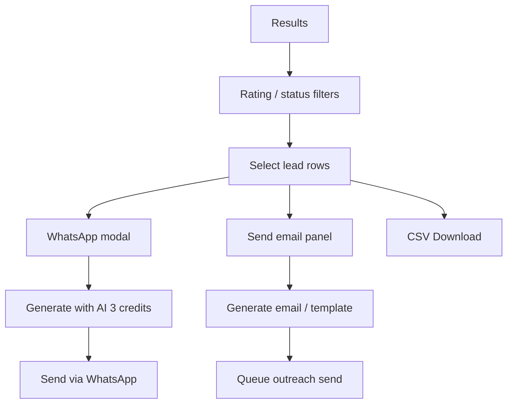
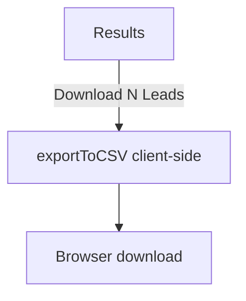
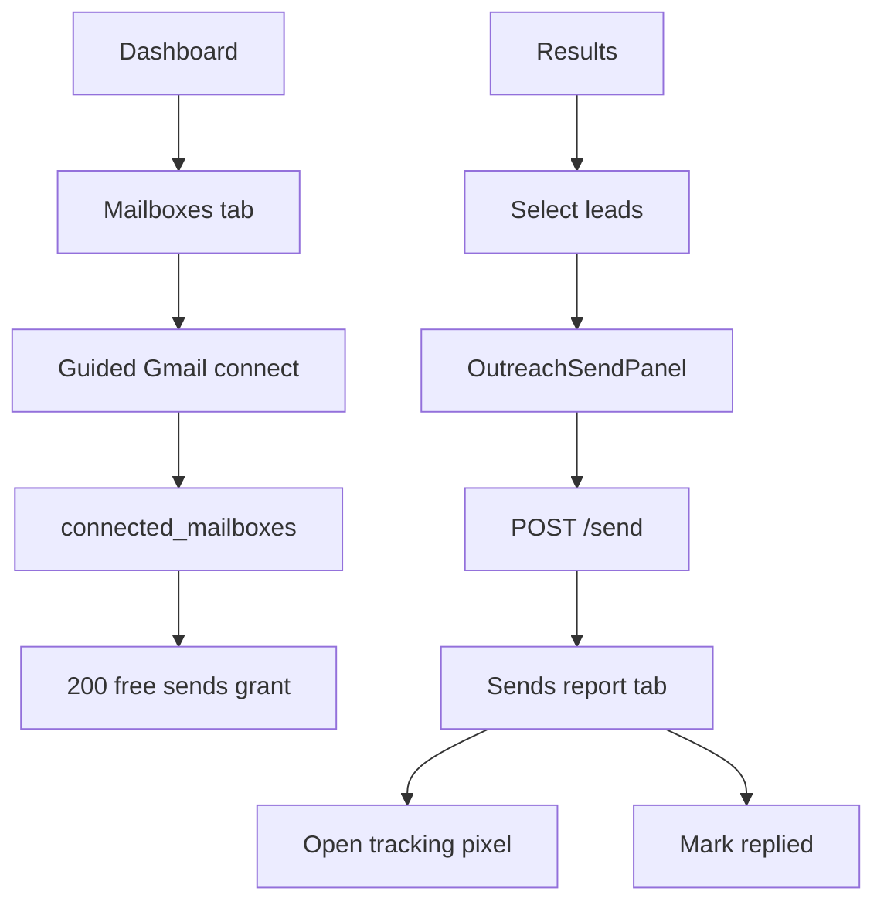
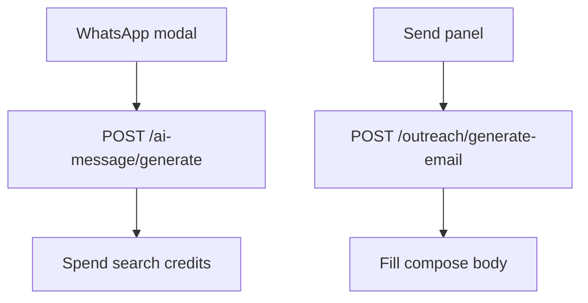
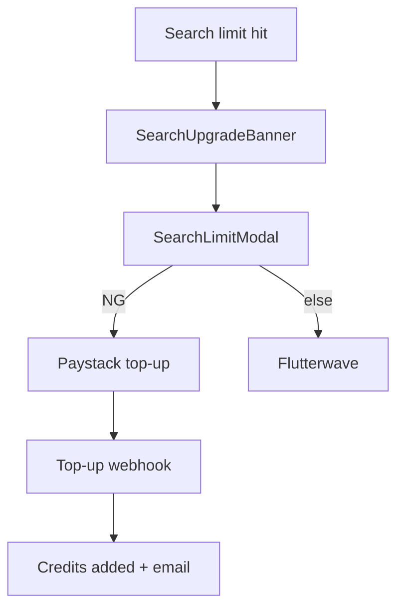
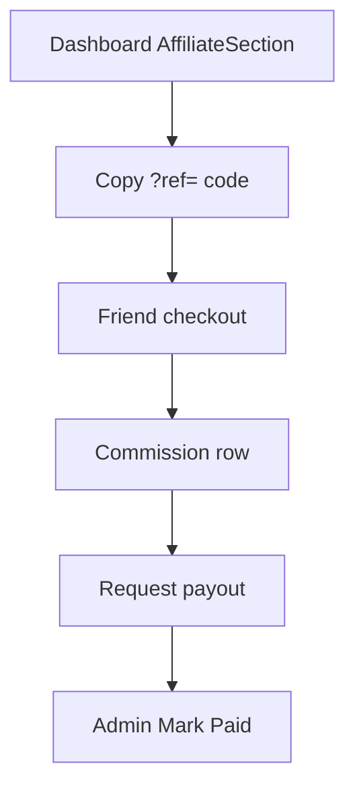

# LeadThur UI Audit — User Flows

**Source:** Frontend routes + backend fulfillment/search/outreach code paths.

---

## Flow A — Acquisition (Landing → Trial → Upgrade)

```mermaid
flowchart TD
  L[Landing /] -->|Try Free| FT[/freetrial email gate]
  L -->|Claim Lifetime| CO[/checkout]
  FT -->|Start My 2 Free Searches| TS[Trial signup API]
  TS --> S1[Run free search]
  S1 --> R1[Blurred results]
  R1 -->|2nd search or scroll paywall| PW[Get lifetime access]
  PW --> CO
  CO -->|Paystack/Flutterwave| WH[Webhook fulfillment]
  WH --> EM[Activation email]
  EM --> ACT[/activate]
```

**Screens:** Home, Free Trial, Checkout, Checkout Success / Payment Success, Activate  
**Drop-offs:** Email gate friction; paywall before value fully felt; dual success URLs

---

## Flow B — Activation → First Search

```mermaid
flowchart TD
  ACT[/activate] -->|email + key| AUTH[POST /auth/activate]
  AUTH --> LS[localStorage license]
  LS --> D[/dashboard]
  D -->|OnboardingModal if first visit| OB[4 steps]
  OB --> W[WelcomeState examples]
  W --> SR[Search business + city]
  SR --> Q[Queue / SSE stream]
  Q --> RES[Results table]
```

**Screens:** Activate, Dashboard, Onboarding Modal, Welcome State, Results  
**Permissions:** Paid license required (client gate)

---

## Flow C — Lead Discovery → Business Actions



**Screens:** Dashboard Results tab, WhatsApp Modal, Outreach Send Panel  
**Business detail page:** Not Found (no dedicated detail route — row/card only)

---

## Flow D — Export



**ExportModal:** Not Found in live path (component unused)

---

## Flow E — Outreach Setup → Campaign



**Billing side path:** `/dashboard/plans` → Paystack subscription/pack → `/checkout/success`

---

## Flow F — AI Assist



**Provider:** DeepSeek (backend)

---

## Flow G — Search Credits Billing



---

## Flow H — Affiliate



---

## Flow I — Admin Ops

```mermaid
flowchart TD
  A[/admin login] --> JWT[Admin JWT]
  JWT --> LOOK[Account Lookup]
  JWT --> GEN[Generate Access]
  JWT --> MSG[Direct Messaging / Broadcast]
  JWT --> BLOG[Blog Manager]
  JWT --> PAY[Payouts]
  JWT --> TRIAL[Trial insights / broadcast]
  JWT --> SCR[Site scripts]
```

---

## Flow J — Suspension

```mermaid
flowchart TD
  D[Dashboard poll /auth/status] -->|SUSPENDED| S[/suspended]
  S -->|Contact WhatsApp| SUP[Support]
  S -->|poll valid| D2[/dashboard]
```

---

## Flow summary table

| Flow | Entry | Exit success | Key risk |
|------|-------|--------------|----------|
| Acquisition | `/` | License email | Trial→paywall conversion |
| Activation | `/activate` | First search | License UX confusion |
| Discovery | Dashboard search | Results | Scrape time / empty |
| Export | Download | CSV file | No confirmation modal live |
| Outreach | Mailbox connect | Sent + tracked | Gmail app password friction |
| AI | Modal/panel | Message ready | Credit cost surprise |
| Billing search | Limit modal | Credits | Dual gateways |
| Billing outreach | `/dashboard/plans` | Balance up | Weak page auth |
| Affiliate | Dashboard section | Payout | Manual admin pay |
| Admin | `/admin` | Ops done | Script injection power |

**Total documented user flows:** 10 primary (A–J)
